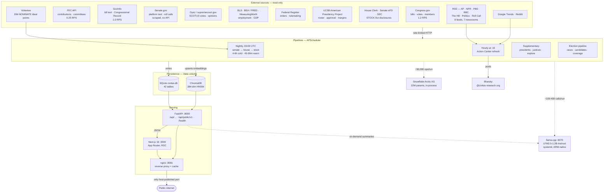

# System architecture

Everything runs on one Raspberry Pi 5 (16 GB, NVMe). No cloud GPU, no
third-party AI API, no data leaving the device.

## Reading the diagram

**Solid edges are data flow; dotted edges are inference calls.** The ratio is
the point: roughly 50,000 embedding operations per run against 100–400 LLM
calls. Civitas is a semantic classification and retrieval system that uses a
language model only at the final synthesis step, not an LLM application.

**The two models live in different places.** The embedding model runs
in-process inside the backend container (~90 MB resident). The LLM runs as a
*host* systemd service outside Docker, so model weights stay in RAM across
backend redeploys. The backend reaches it at `host.docker.internal:8070`.

**Only nginx is published to the host.** Backend and frontend bind to the
overlay network only — Swarm's host-mode publishing cannot restrict to
`127.0.0.1`, so rather than accept LAN-wide exposure they aren't published at
all. See [08 — Deployment](08-deployment.md).

**If llama.cpp is unavailable**, LLM calls fall through to a timeout and the
pipeline records a per-member failure without aborting the run. Scores still
compute — they are deterministic and take no LLM input.

## Source map

| Component | Code |
|---|---|
| Pipeline orchestration | `backend/app/pipeline/{senate,house,president,justice,explore,election,stock}_pipeline.py` |
| Scheduler | `backend/app/scheduler.py` |
| LLM client | `backend/app/pipeline/analyze/ollama_client.py` |
| Embeddings + ChromaDB | `backend/app/pipeline/vector_store.py` |
| API routes | `backend/app/api/` |
| Frontend | `frontend/src/app/` |
