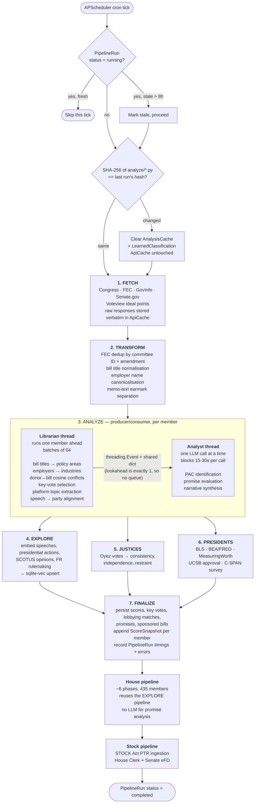

# Nightly pipeline

Runs at 03:00 UTC by default (`PIPELINE_CRON_SCHEDULE`). Processes all 100
senators and 435 representatives, then a stock-disclosure pass.

## Why the Librarian runs one member ahead

The Analyst blocks on LLM HTTP for 15–30s per member. In that window the
Librarian computes the *next* member's embedding work (2–4s). Across 100
senators that recovers 200–400s of wall clock — a 10–15% reduction — at zero
extra peak memory, because the lookahead is exactly one member rather than a
full queue.

Peak memory during this phase, with embedding and LLM work overlapped, reaches
about 3 GB.

## The SQLite mutex

Concurrency control is a row in `pipeline_runs` (`status == "running"`), not a
process-level lock. That choice is what makes rolling deploys safe: a new
container starting mid-run finds the in-progress row and marks it `stale`
rather than blocking or double-running. See `backend/app/scheduler.py`.

## The fingerprint gate

At start, a SHA-256 over every file in `pipeline/analyze/` is compared to the
hash stored on the last `PipelineRun`. If the analysis code changed, derived
artifacts are cleared so updated logic can't serve results computed by the old
logic.

`ApiCache` is deliberately exempt — it holds raw source data, which doesn't
become wrong because analysis code changed. See [06 — Caching](06-caching.md).

## Source map

| Stage | Code |
|---|---|
| Orchestration | `backend/app/pipeline/senate_pipeline.py`, `house_pipeline.py` |
| Fetch clients | `backend/app/pipeline/fetch/` |
| Transform | `backend/app/pipeline/transform/` |
| Analyze | `backend/app/pipeline/analyze/` |
| Assemble + validate | `backend/app/pipeline/assemble/` |
| Run bookkeeping | `backend/app/pipeline/run_tracker.py`, `progress_tracker.py` |
