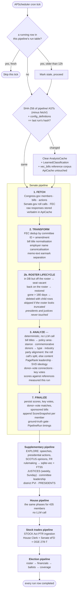

# Nightly pipeline

Runs at 03:00 UTC by default (`PIPELINE_CRON_SCHEDULE`) as a chain of five
pipelines, each started only if the one before it finished
(`scheduler._nightly_pipeline`): **Senate → Supplementary → House → Stock
trades → Election.** A failure partway down means nothing after it runs, and
leaves no run row behind to look wrong; `ops_alerts.check_pipeline_staleness`
is what notices.

```mermaid
flowchart TB
    START(["APScheduler cron tick"]) --> LOCK{"a running row in<br/>this pipeline's run table?"}
    LOCK -->|yes, fresh| SKIP(["Skip this tick"])
    LOCK -->|yes, older than 12h| MARK["Mark stale, proceed"]
    LOCK -->|no| FP
    MARK --> FP

    FP{"SHA-256 of pipeline/ ASTs (minus fetch/)<br/>+ config_definitions<br/>== last run's hash?"}
    FP -->|changed| CLEAR["Clear AnalysisCache<br/>+ LearnedClassification<br/>+ vec_bills reference corpus<br/>ApiCache untouched"]
    FP -->|same| P1
    CLEAR --> P1

    subgraph SENATE["Senate pipeline"]
        P1["<b>1. FETCH</b><br/>Congress.gov members · bills · actions<br/>Senate.gov roll calls · FEC<br/>raw responses stored verbatim in ApiCache"]
        P2["<b>2. TRANSFORM</b><br/>FEC dedup by committee ID + amendment<br/>bill title normalisation<br/>employer name canonicalisation<br/>memo-text earmark separation"]
        P2B["<b>2b. ROSTER LIFECYCLE</b><br/>in DB but off the roster → seat vacant<br/>back on the roster → restored<br/>gone > 180 days → deleted with child rows<br/><i>skipped if the roster looks truncated</i><br/><i>presidents and justices never touched</i>"]
        P3["<b>3. ANALYZE</b> — deterministic, no LLM call<br/>bill titles → policy area · stance · commemorative<br/>donors → type · industry<br/>party alignment: the roll call's split, else content<br/>PageRank leadership · SVD ideology<br/>donor–vote connections · key votes<br/>scores against references measured this run"]
        P7["<b>7. FINALIZE</b><br/>persist scores, key votes, donor–vote matches,<br/>sponsored bills<br/>append ScoreSnapshot per member<br/>ground-truth gate · PipelineRun timings"]
        P1 --> P2 --> P2B --> P3 --> P7
    end

    P7 --> SUPP["<b>Supplementary pipeline</b><br/>EXPLORE: speeches, presidential actions,<br/>SCOTUS opinions, FR rulemaking → sqlite-vec + FTS5<br/>JUSTICES (weekly, Sunday) · committee leadership<br/>district PVI · PRESIDENTS"]
    SUPP --> HOUSE["<b>House pipeline</b><br/>the same phases for 435 members<br/>no LLM call"]
    HOUSE --> STOCK["<b>Stock trades pipeline</b><br/>STOCK Act PTR ingestion<br/>House Clerk + Senate eFD + OGE 278-T"]
    STOCK --> ELECT["<b>Election pipeline</b><br/>roster → financials → ballots → coverage"]
    ELECT --> DONE(["every run row completed"])
```

## Why ANALYZE runs one member at a time

It used to overlap work: a "Librarian" thread computed the next member's
embeddings while the "Analyst" waited 15–30s on an LLM call. ANALYZE makes no
LLM call now, so there is nothing to overlap with. Each member's embedding
work (`precompute_senator_analysis`) runs, then its scoring, in order.

## Why a truncated roster can't retire a chamber

Roster reconciliation infers departure from *absence* — a member in the
database but missing from tonight's fetch has left office. That inference is
only as good as the fetch, and `fetch_senators` breaks out of its pagination
loop on a failed page rather than raising, then caches whatever it collected.
One bad response could therefore look like a mass resignation.

So reconciliation refuses to run when the roster is smaller than 90% of the
members currently recorded as serving, and raises an ops alert rather than
skipping silently. Real turnover still passes: at a new Congress the roster is
*replaced*, not shrunk, so a 60–80 member freshman class clears the check.

Removal is separately guarded. `left_office_date` is compared as a string, so
a malformed value ("2026", "07/01/2026") would sort below any cutoff and
delete a member outright; the purge restamps anything that isn't a real
`YYYY-MM-DD` date instead of acting on it, and the admin vacancy endpoint
rejects it up front.

## The SQLite mutex

Concurrency control is a row in each pipeline's run table with
`status == "running"`, not a process-level lock: a partial UNIQUE index lets
only one process insert it, so the two backend processes that overlap during a
Swarm rollout can't both start the same pipeline
(`run_tracker.acquire_pipeline_lock_why`). Pipelines are threads of the backend,
so a restart kills them without letting them record it; on startup the backend
marks every pipeline's leftover `running` row `stale`
(`main._invalidate_orphaned_pipelines`), sparing only a Senate run whose
lease is still beating in the other task, and a row older than 12 hours is
cleared at the next acquisition. `check-and-deploy.sh` does not deploy while
any pipeline runs.

## The fingerprint gate

At start, a SHA-256 over every analysis-relevant file — all of `app/pipeline/`
except `fetch/`, plus `config_definitions.py`, each hashed as its
docstring-stripped AST so comment edits don't count — is compared to the hash
stored on the last `PipelineRun`. If the analysis code changed, derived
artifacts are cleared so updated logic can't serve results computed by the old
logic.

`ApiCache` is deliberately exempt — it holds raw source data, which doesn't
become wrong because analysis code changed. See [06 — Caching](06-caching.md).

## Source map

| Stage | Code |
|---|---|
| Orchestration | `backend/app/scheduler.py` (the chain), `backend/app/pipeline/senate_pipeline.py`, `supplementary_pipeline.py`, `house_pipeline.py`, `stock_pipeline.py`, `election_pipeline.py` |
| Fetch clients | `backend/app/pipeline/fetch/` |
| Transform | `backend/app/pipeline/transform/` |
| Roster lifecycle | `backend/app/pipeline/member_lifecycle.py` |
| Analyze | `backend/app/pipeline/analyze/` |
| Assemble + validate | `backend/app/pipeline/assemble/` |
| Run bookkeeping | `backend/app/pipeline/run_tracker.py`, `progress_tracker.py` |
| Election cycle (separate pipeline) | `backend/app/pipeline/election_pipeline.py` — roster → financials → ballot measures → coverage → Bluesky → snapshot |
