# Action Center pipeline

Runs hourly at :15, separate from the nightly pipeline because it operates on a
different timescale and different data.

```mermaid
flowchart TB
    TICK(["Hourly at :15"]) --> FETCH

    FETCH["<b>1. FETCH</b><br/>8 RSS feeds across 7 newsrooms<br/>+ Google Trends + Reddit<br/>48h article window · direct URLs only"]
    FETCH --> FILTER

    FILTER["<b>2. FILTER</b><br/>embed each article against<br/>24 policy prototypes (19 US, 5 international)"]
    FILTER --> RELCHECK{"cosine ≥ 0.22?"}
    RELCHECK -->|no| DROP(["Discard — off topic"])
    RELCHECK -->|yes| CLUSTER

    CLUSTER["<b>3. CLUSTER</b><br/>pairwise cosine on title embeddings<br/>merge from centroid sim 0.20,<br/>self-calibrating up in 0.05 steps to 0.61"]
    CLUSTER --> RANK

    RANK["<b>4. RANK</b><br/>0.40 × civic actionability<br/>0.35 × source breadth<br/>0.25 × trending relevance"]
    RANK --> TOP["Select top 2 (MAX_ISSUES)"]
    TOP --> LLM

    LLM["<b>5. LLM</b><br/>per cluster: neutral summary,<br/>key facts, citizen actions"]
    LLM --> DEDUP{"title cosine > 0.92<br/>vs another generated title?"}
    DEDUP -->|yes| MERGE["Drop as near-duplicate"]
    DEDUP -->|no| MATCH

    MATCH{"<b>6. PERSIST</b><br/>matches an existing topic?<br/>2-day lookback, title cosine"}
    MATCH -->|"no match"| NEWROW["Create row<br/>bsky_posted_at = null"]
    MATCH -->|"match, newer article<br/>+ new information"| UPDCONTENT["Update content<br/>advance primary_article_date<br/>allow Bluesky repost"]
    MATCH -->|"match, no newer article<br/>or nothing new to say"| UPDRANK["Update rank silently<br/>no repost"]

    NEWROW --> ENRICH
    UPDCONTENT --> ENRICH
    UPDRANK --> ENRICH

    ENRICH["<b>7. ENRICH</b><br/>sqlite-vec semantic search →<br/>related bills, senators, documents<br/>resolve bill IDs in article text"]
    ENRICH --> MON

    MON{"<b>8. MONITORS</b><br/>topic recurs on ≥ 5 distinct days in 14,<br/>from ≥ 3 unique sources,<br/>title similarity ≥ 0.83?"}
    MON -->|yes| SIGGATE{"LLM significance gate"}
    MON -->|no| TIMELINE
    SIGGATE -->|passes| MONREC["Create/update NationalMonitor<br/>re-merge duplicates at sim > 0.50"]
    SIGGATE -->|fails| TIMELINE
    MONREC --> TIMELINE

    TIMELINE["<b>9. TIMELINE</b><br/>record daily TimelineEntry<br/>at week/month/year boundaries,<br/>LLM writes the period summary"]
    TIMELINE --> POST

    POST["<b>10. BLUESKY</b><br/>new/updated issue posts<br/>daily senator spotlight<br/>weekly civic summary<br/>repost + like matching posts from AP, NPR, PBS<br/>(≥ 0.78, under 24h old, max 3/run)"]
```

The daily spotlight and the weekly summary also run on the two early-abort
paths (no articles fetched, none policy-relevant). Neither reads the news —
the spotlight reads senator scores, the weekly reads the timeline's own
WeekSummary rows — but both used to sit downstream of those aborts, so a bad
hour of feeds silenced them too, and a run of such hours spanning a UTC day
boundary dropped that day's spotlight for good (`post_daily_spotlight` asks
whether one went out *today*, not whether the last one is overdue). Running
them unconditionally also makes the spotlight a free liveness check: if it is
missing from the feed, the refresh is not completing.

## Why the thresholds are what they are

**Cluster before ranking.** Articles about one event arrive from several outlets
within minutes. Rank first and all four "top issues" are the same story from AP,
NPR, BBC and PBS. Clustering first, then ranking by source breadth, surfaces
four *distinct* stories.

**0.22 relevance filter is deliberately permissive.** A false negative drops a
real policy story; a false positive gets caught downstream by the LLM's
non-partisan framing constraint. The asymmetry favours recall.

**Self-calibrating cluster merge.** A fixed similarity threshold either
fragments one story across many clusters or collapses everything into one
mega-cluster, depending on the day's news. Starting at 0.20 and stepping up to
at most 0.61 lets the run find its own threshold.

**5 days in 14 for a monitor.** A topic in the top issues on five separate days
within a fortnight is structurally different from a one-day spike — it's a
developing situation. Shorter thresholds produced too many ephemeral monitors.

**Topic-keyed persistence, not rank-slot.** The original design keyed issues by
`(date, rank)`. When a story briefly fell out of the top 4 and returned, it got
a new row with `bsky_posted_at = null` — and was posted to Bluesky a second
time. Keying by topic similarity over a 2-day lookback means one story maps to
one permanent row and one permalink, regardless of rank churn. More outlets
covering the same event is not a reason to repost.

**A newer article is necessary but not sufficient to repost.** Recap coverage
rewords the same names and numbers under a fresher timestamp, so the date alone
let a story repost with nothing new to say. The facts must also add a named
entity, a figure, or a story development (a veto, a court blocking an order, a
failed override) that wasn't there as of the last post — measured against
`bsky_posted_facts`, not the live `facts` column, which every hourly refresh
overwrites whether or not anything was posted. Two counters make the gate
observable: `bsky_reposts_allowed` and
`bsky_reposts_suppressed_no_new_information`.

## Silence is the shared failure mode, so every run is counted

About ten checks in this pipeline fail closed, and a story dropped by any of
them looks exactly like a story that was never there: no issue, no post. The
counters above are per-gate for that reason, and they are written on every exit
path — including the two early aborts (nothing fetched, nothing policy-relevant)
that used to return before the persist, leaving the runs with the most
diagnostic value as the only ones with no record at all.

Each run also records volume at three points, so a quiet cycle is a number to
compare rather than an inference drawn from an absence:

| Group | Counters | Reads as |
|-------|----------|----------|
| Intake | `articles_fetched`, `articles_policy_relevant`, `clusters_considered` | what the pipeline saw |
| Output | `issues_new_topic`, `issues_matched_existing`, `bsky_reposts_allowed` | what it published |
| Suppressed | the `issues_skipped_*` and `bsky_*_suppressed_*` family | what it dropped, and by which gate |

`issues_new_topic` and `issues_matched_existing` are split because the pipeline's
own `issues_created` counts both — a run that only re-matched yesterday's stories
reported the same number as one that found four fresh ones, which is exactly the
distinction between a quiet news cycle and new topics being dropped on the way in.

`GET /api/admin/action-metrics` returns the window with the three groups totalled.

## Known limitation, disclosed on the methodology page

Under common media-bias ratings the source diet spans centre to lean-left, with
no right-of-center outlet currently included. That is a property of the feed
list, not a neutral sample of all coverage.

## Source map

| Stage | Code |
|---|---|
| Whole pipeline | `backend/app/pipeline/analyze/action_center.py` |
| Ranking | `action_center.py::_rank_clusters` |
| Policy prototypes | `action_center.py::_POLICY_PROTOTYPES` |
| Feed list | `backend/app/pipeline/fetch/news_feeds.py::NEWS_FEEDS` |
| Trending | `backend/app/pipeline/fetch/trending.py` |
| Bluesky | `analyze/bluesky_{poster,spotlight,engagement,utils}.py` |
