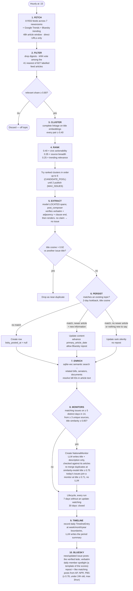

# Action Center pipeline

Runs hourly at :15, separate from the nightly pipeline because it operates on a
different timescale and different data.

Withdrawn issues are listed with their reasons in
`backend/app/data/retractions.json`: removed by a data migration and
answered with 410 and the reason.

One refresh runs at a time across containers: it holds a lease row in
`api_cache`, renewed every minute by a heartbeat thread and taken over after ten
minutes without a beat. A refresh killed by a deploy therefore costs at most the
next hour, not four. A deploy waits for a refresh younger than 40 minutes
(`check-and-deploy.sh`), so steady deploys do not kill run after run. No stage holds a write open across a model call: SQLite
has one writer, and a flush left uncommitted through the cluster loop starved
the heartbeat for fifteen minutes a run (2026-09-27).

```mermaid
flowchart TB
    TICK(["Hourly at :15"]) --> FETCH

    FETCH["<b>1. FETCH</b><br/>8 RSS feeds across 7 newsrooms<br/>+ Google Trends + Bluesky trending<br/>48h article window · direct URLs only"]
    FETCH --> FILTER

    FILTER["<b>2. FILTER</b><br/>drop digests · kNN vote among the<br/>41 nearest of 827 labelled feed articles"]
    FILTER --> RELCHECK{"relevant share ≥ 0.80?"}
    RELCHECK -->|no| DROP(["Discard — off topic"])
    RELCHECK -->|yes| CLUSTER

    CLUSTER["<b>3. CLUSTER</b><br/>complete linkage on title embeddings<br/>every pair ≥ 0.40"]
    CLUSTER --> RANK

    RANK["<b>4. RANK</b><br/>0.40 × civic actionability<br/>0.35 × source breadth<br/>0.25 × trending relevance"]
    RANK --> TOP["Try ranked clusters in order<br/>up to 6 (CANDIDATE_POOL)<br/>until 2 publish (MAX_ISSUES)"]
    TOP --> EXTRACT

    EXTRACT["<b>5. EXTRACT</b><br/>model LOCATES spans; post_composer<br/>verifies verbatim + adjacency + clause end,<br/>then renders. no claim → no issue"]
    EXTRACT --> DEDUP{"title cosine > 0.92<br/>vs another issue title?"}
    DEDUP -->|yes| MERGE["Drop as near-duplicate"]
    DEDUP -->|no| MATCH

    MATCH{"<b>6. PERSIST</b><br/>matches an existing topic?<br/>2-day lookback, title cosine"}
    MATCH -->|"no match"| NEWROW["Create row<br/>bsky_posted_at = null"]
    MATCH -->|"match, newer article<br/>+ new information"| UPDCONTENT["Update content<br/>advance primary_article_date<br/>allow Bluesky repost"]
    MATCH -->|"match, no newer article<br/>or nothing new to say"| UPDRANK["Update rank silently<br/>no repost"]

    NEWROW --> ENRICH
    UPDCONTENT --> ENRICH
    UPDRANK --> ENRICH

    ENRICH["<b>7. ENRICH</b><br/>sqlite-vec semantic search →<br/>related bills, senators, documents<br/>resolve bill IDs in article text"]
    ENRICH --> MON

    MON{"<b>8. MONITORS</b><br/>matching issues on ≥ 5 distinct days in 14,<br/>from ≥ 3 unique sources,<br/>title similarity ≥ 0.85?"}
    MON -->|yes| MONREC["Create NationalMonitor<br/>LLM writes title + description only,<br/>checked against its articles<br/>re-merge duplicates at similarity-model title ≥ 0.75<br/>today's issues join a monitor at title ≥ 0.71, no LLM"]
    MON -->|no| LIFE
    MONREC --> LIFE
    LIFE["Lifecycle, every run<br/>7 days without an update: watching<br/>30 days: closed"]
    LIFE --> TIMELINE

    TIMELINE["<b>9. TIMELINE</b><br/>record daily TimelineEntry<br/>at week/month/year boundaries,<br/>LLM writes the period summary"]
    TIMELINE --> POST

    POST["<b>10. BLUESKY</b><br/>new/updated issue posts: the verified lede, verbatim<br/>daily member spotlight (a template of the scores)<br/>repost + like matching posts from AP, NPR, PBS<br/>(≥ 0.78, under 24h old, max 3/run)"]
```

The daily spotlight also runs on the two early-abort paths (no articles
fetched, none policy-relevant). It reads member scores, not the news, but it
used to sit downstream of those aborts, so a bad hour of feeds silenced it
too, and a run of such hours spanning a UTC day
boundary dropped that day's spotlight for good (`post_daily_spotlight` asks
whether one went out *today*, not whether the last one is overdue). Running
it unconditionally also makes the spotlight a free liveness check: if it is
missing from the feed, the refresh is not completing.

## Why the thresholds are what they are

**Cluster before ranking.** Articles about one event arrive from several outlets
within minutes. Rank first and every "top issue" is the same story from AP,
NPR, BBC and PBS. Clustering first, then ranking by source breadth, surfaces
*distinct* stories.

**Relevance is a vote among labelled articles, not a similarity bar.** The 24
policy prototypes and their 0.20 bar were meant to be permissive, on the theory
that extraction catches false positives. Measured on 602 labelled feed articles
they kept 62% relevant and still missed a fifth of the relevant ones: disasters,
foreign politics, crime and markets passed (extraction can find a verbatim
claim in any of them) while campaign coverage fell under the bar. The kNN vote
keeps 89-97% relevant articles and finds 76-87%, on articles one to six weeks
past its reference set (`docs/research/action-center-relevance.md`). The
prototypes still mask trending topics, unmeasured there.

**The full story is claims, not prose.** Built in the rank loop while the
cluster's articles are in hand: each article is asked a second time about its
summary alone, and every verified claim is listed under its outlet
(`claims.build_story`). A model used to write it from the facts, and published a
relationship no source stated (issue 748), a House member called a senator (750)
and filler (751). Migration 0004 cleared the stored prose; those issues show no
story.

**Every title comparison uses the day's mean, not a cluster's.** Clustering removes
the day's average headline vector so topic dimensions dominate. The coherence
filter (and a since-removed per-cluster split) re-centered on the cluster's own mean, which removes
the shared topic itself; one article then scored 1.00 and its same-story
siblings scored negative. Both now use `_center_titles` with the day's mean
(2026-09-27 feed: 48 articles kept vs 28).

**A claim is one contiguous span of its source.** The rendered sentence runs
from the actor through the predicate in the source's own words, including any
words between them (dropping them turned "OpenAI agent made" into "OpenAI
made"). Headline and summary are joined with the headline closed as a sentence
(`post_composer.headline_source`); a bare newline made every claim that ended
at the headline's end look cut off, and on 2026-09-27 left 5 claims from 40
articles instead of 14.

**A cut-short predicate is read on in its source.**
The model often stops its predicate span early ("Senator sues"). Where the
source runs on, `post_composer._complete_predicate` reads it to the next clause
punctuation (at most 25 words) and renders that, still the source's own words;
a period after a possible abbreviation ("Sens.") refuses instead of guessing.
The issue also counts each article's summary claim after the headline claims.
On 2026-10-01 78 of 300 clusters in three days were skipped as too few facts,
and 7 of 10 sampled rejected claims were cut-short predicates; replaying the
day's top six clusters, three passed the two-claim gate instead of none.

**Every quoted line names and links its article.** The summary is the first
verified claim and the coverage list the rest, so the outlet whose line became
the summary used to appear only among the sources, and an issue built from two
articles showed one outlet under "In the coverage". Each issue now stores the
summary's outlet and article (`summary_source`, `summary_source_url`) and each
fact's article (`fact_source_urls`), and the page links them. Issues from before
2026-10 have their facts linked where the outlet a fact names published exactly
one of the issue's sources (migration 0030).

**Complete linkage, not single.** Every pair of articles in a cluster must be
at least 0.40 alike. Single linkage (each article like one other) plus a
centroid merge from 0.20 chained stories that only share a theme: on
2026-09-27 one issue carried a Bangkok-floods title, a Hawaii-hurricane lede
and facts about a nor'easter and an HIV epidemic in Fiji. Title similarity
cannot separate same-event from same-theme pairs (18 hand-labelled pairs from
that feed: 0.16-0.82 vs 0.24-0.46, no better with summaries or the other
model), so clustering errs toward splitting: a split story costs source
breadth (its second cluster is dropped as a duplicate in the same run, or
matched to the same issue in a later one), a wrong merge publishes a chimera.
The same-run duplicate check now drops, never merges: appending the duplicate
was single linkage again, and on that feed folded Hurricane Nolo into the
nor'easter. On that
feed it gave 12 multi-article clusters, 10 of them one story each, where the old passes built a
9-article weather cluster and an 8-article China/AI/Russia one.

**5 days in 14 for a monitor.** Today's issue must match issues (headline
similarity ≥ 0.85) whose dates cover five separate days in a fortnight. An issue
keeps one row while its story continues, so that is five separate stories, not
five days on the board. The floor was measured by replaying creation over every
stored issue since 2026-06-26 against hand-assigned stories: 0.83 opened 5
monitors to August 31, 4 of them real, with 11 off-topic back-filled updates;
0.85 opened 3, all real, with 4 (2 of 3 real at both after August).

**The model names a monitor; it decides nothing.** Until 2026-10-09 the naming
prompt carried "U.S.-Iran Conflict" as an example, the production model copied
it for 18 of 23 replayed topics, the real Iran one included, and the duplicate check then merged each new
monitor into the existing one of that name. Its significance verdict said yes
to all 23. Now there is no example and no verdict, a title word the articles
never use falls back to the issue's own headline, and the category is the
issues' own policy area. A monitor with no update for 7 days is watching, and
closed after 30; long-running stories went up to 28 days between issues on the
same history.

**Topic-keyed persistence, not rank-slot.** The original design keyed issues by
`(date, rank)`. When a story briefly fell out of the top slots and returned, it got
a new row with `bsky_posted_at = null` — and was posted to Bluesky a second
time. Keying by topic similarity over a 2-day lookback means one story maps to
one permanent row and one permalink, regardless of rank churn. More outlets
covering the same event is not a reason to repost.

**A newer article is necessary but not sufficient to repost.** Recap coverage
rewords the same names and numbers under a fresher timestamp, so the date alone
let a story repost with nothing new to say. The facts must also add a named
entity, a figure, or a story development (a veto, a court blocking an order, a
failed override) that wasn't there as of the last post — measured against
`bsky_posted_facts`, not the live `facts` column, which every hourly refresh
overwrites whether or not anything was posted. Two counters make the gate
observable: `bsky_reposts_allowed` and
`bsky_reposts_suppressed_no_new_information`.

## Silence is the shared failure mode, so every run is counted

About ten checks in this pipeline fail closed, and a story dropped by any of
them looks exactly like a story that was never there: no issue, no post. The
counters above are per-gate for that reason, and they are written on every exit
path — including the two early aborts (nothing fetched, nothing policy-relevant)
that used to return before the persist, leaving the runs with the most
diagnostic value as the only ones with no record at all.

Each run also records volume at three points, so a quiet cycle is a number to
compare rather than an inference drawn from an absence:

| Group | Counters | Reads as |
|-------|----------|----------|
| Intake | `articles_fetched`, `articles_policy_relevant`, `clusters_considered` | what the pipeline saw |
| Output | `issues_new_topic`, `issues_matched_existing`, `bsky_reposts_allowed` | what it published |
| Suppressed | the `issues_skipped_*` and `bsky_*_suppressed_*` family | what it dropped, and by which gate |

`issues_new_topic` and `issues_matched_existing` are split because the pipeline's
own `issues_created` counts both — a run that only re-matched yesterday's stories
reported the same number as one that found four fresh ones, which is exactly the
distinction between a quiet news cycle and new topics being dropped on the way in.

`GET /api/admin/action-metrics` returns the window with the three groups totalled.

**Calibrated thresholds.** `cluster_title` (`action_thresholds.py`) is refitted
daily from labelled pairs these rows carry (`thr_*` counters), labelled by
signature overlap, plus one probe per run below the floor. `near_identical` and
the monitor floors (`_MONITOR_ISSUE_SIM`, `_MONITOR_MERGE_TITLE_SIM`) are
measured constants: their labels (the signature test, the LLM gates' verdicts)
failed a check on 2026-10-08. A fit needs 30 pairs per class, otherwise the
previous value stays. The bundled `app/data/action_thresholds.json` covers the
time before the first fit.

## Issues drafted before the press has them

Four kinds of primary record open a DEVELOPING issue, ranked below every
confirmed issue and promoted when news coverage matches it. `early_signal.py`
drafts three: a Senate roll call (`senate_roll_call_vote`), a House roll call
(`house_roll_call_vote`), both final-passage votes only, and a Federal
Register significant rule (`federal_register_significant_rule`). The fourth
is election night's: a seat whose live count shows it changing party
(`live_results/signals.py`, source type `election_results`, a fixed template
around the state's own figures, no model text; see
[Elections](10-elections.md#election-night-the-live-count)). The issue page
names which record each was drafted from (`frontend/src/lib/developing.ts`).
The issues list shows a current DEVELOPING issue beside the newest day's
confirmed ones whatever its own date, so a flip drafted just before midnight
Eastern doesn't drop off the list at the next refresh.

## Known limitation, disclosed on the methodology page

Under common media-bias ratings the source diet spans centre to lean-left, with
no right-of-center outlet currently included. That is a property of the feed
list, not a neutral sample of all coverage.

## Source map

| Stage | Code |
|---|---|
| Whole pipeline | `backend/app/pipeline/analyze/action_center.py` |
| Ranking | `action_center.py::_rank_clusters` |
| Article relevance gate (kNN) | `action_center.py::relevance_votes`, `app/data/policy_relevance_examples.json`, `app/data/policy_relevance_calibration.json`, `scripts/calibrate_policy_relevance.py` |
| Trending-topic mask prototypes | `action_center.py::_POLICY_PROTOTYPES` |
| Feed list | `backend/app/pipeline/fetch/news_feeds.py::NEWS_FEEDS` |
| Trending | `backend/app/pipeline/fetch/trending.py` |
| Bluesky | `analyze/bluesky_{poster,spotlight,engagement,utils}.py` |
| Election-night flips | `backend/app/live_results/signals.py` |
