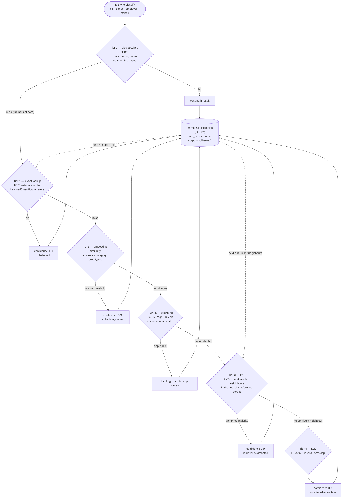

# Classification tiers

The governing rule: classification decisions are made by embedding similarity
against natural-language prototypes, kNN over an accumulated corpus, or exact
structured lookups — never by an arbitrary keyword-to-category judgment call.
Cheaper techniques run first (computational parsimony, Jurafsky & Martin 2023).

## What each tier is actually used for

| Tier | Technique | Speed | Applied to |
|---|---|---|---|
| 1 | FEC metadata / learning-store exact match | instant | Donor types; previously classified bills and donors |
| 2 | Sentence-transformer cosine vs prototypes | fast | Bill policy areas, industry, party alignment, donor types, stance direction, procedural detection, skip-entity detection, employer filtering, memo-transfer detection |
| 2b | SVD / PageRank on cosponsorship matrix | fast | Ideology scoring (Tauberer 2012), legislative leadership (Brin & Page 1998) |
| 3 | k-Nearest Neighbour in embedding space | fast | Remaining unclassified donors (~5%), bill classification from the reference corpus |
| 4 | LLM | slow | Action Center issue synthesis, justice profile summaries |

kNN was chosen over an LLM for donor classification after testing: the LLM
hallucinated categories outside the taxonomy (`SPORTS`, `RESTAURANT`) and took
40+ minutes for ~5,000 donors, against under 5 seconds for kNN, with less
consistent results.

## The three disclosed tier-0 exceptions

These are precision pre-filters for specific, *measured* embedding-model
weaknesses — not a replacement for the classifier. Anything they don't catch
still goes through the real path below them. Each is documented at its point of
definition in code.

| Exception | Where | Why it exists |
|---|---|---|
| Bill stance direction | `bill_analyzer.py::derive_stance` | A tier-0 check against the same word set used to build the pro/anti prototypes, used only to break ties or lower the acceptance margin when the embedding result is already ambiguous. Verified 2026-07 on n=2979 real bill titles: removing it changes 1.5% of outcomes, always by recovering a genuinely directional bill the embedding alone scored neutral. |
| Hotel / lodging industry | `industry_classifier.py::classify_industry_with_provenance` | Hotel brand names measurably score as `MEDIA` rather than `REAL_ESTATE` in this embedding space — a specific, verified anomaly. |
| PAC and payment processors | `donor_classifier_ai.py` | Names containing "PAC" (an FEC filing convention) or matching a closed set of processor brands (ActBlue, WinRed, Anedot). ALL-CAPS FEC-formatted names score inconsistently against mixed-case prototypes. |

Two further structural lookups decode already-known facts rather than classify
anything: the FEC entity-type-code map (`CCM` → `CandidateAffiliated`, decoding
an enum FEC itself assigned) and a Congress-number → majority-party table used
for effectiveness baselines.

## Retrieval-augmented classification

The dotted feedback edges are the point. `LearnedClassification` (SQLite) and
the `vec_bills` sqlite-vec reference corpus both grow every run, so past decisions bootstrap
future ones — lower latency and lower error rate over time (Lewis et al. 2020;
the experience-replay pattern, Lin 1992).

Confidence levels exist so this stays auditable and selectively re-verifiable:
low-confidence classifications from earlier runs can be re-evaluated when
related code changes. Both stores are cleared when the analysis-code fingerprint
changes — see [06 — Caching](06-caching.md).

## Source map

| Concern | Code |
|---|---|
| Bill classification + stance | `backend/app/pipeline/analyze/bill_analyzer.py` |
| Policy taxonomy (18 areas) | `bill_analyzer.py::POLICY_TAXONOMY` |
| kNN reference corpus | `analyze/bill_learning.py` |
| Donor tiers | `analyze/donor_classifier_ai.py`, `analyze/nn_classifier.py` |
| Industry classifier | `transform/industry_classifier.py` |
| Party alignment | `analyze/party_platform.py` |
| Cosponsorship SVD / PageRank | `analyze/sponsorship_analysis.py` |
