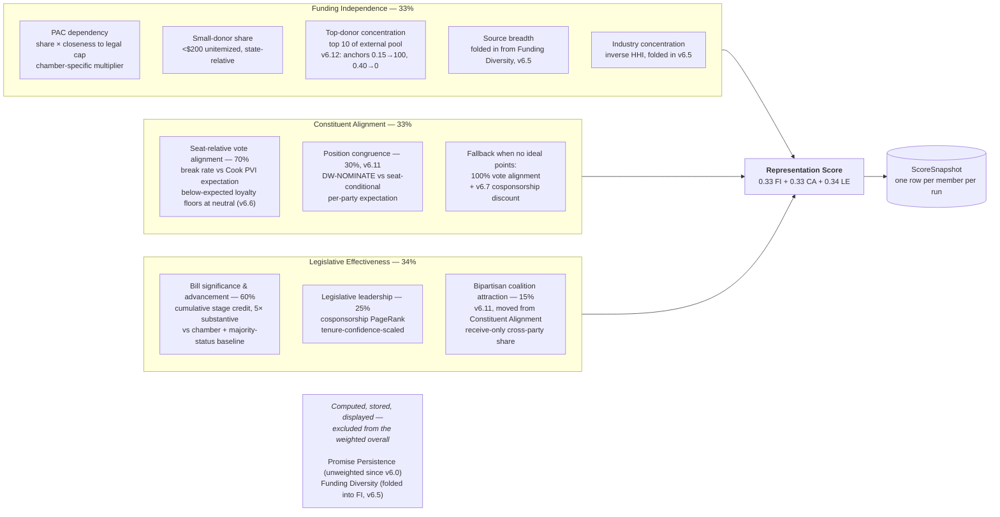
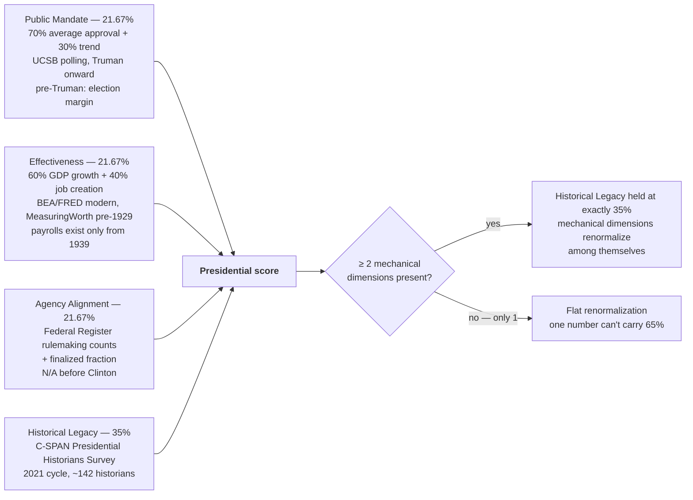
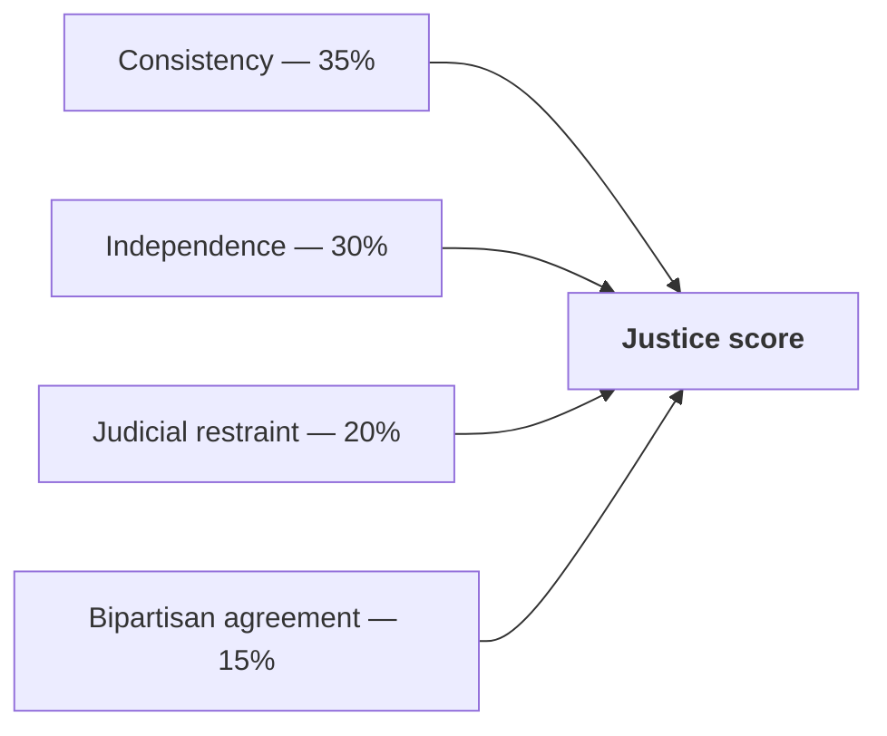

# Scoring

Pinned to `ALGORITHM_VERSION = v6.12`. Weights live in
`backend/app/config_definitions.py` and component splits in
`analyze/score_calculator.py` — **those are authoritative; if this page
disagrees with them, this page is wrong.**

No LLM input enters any score. Every formula is deterministic and auditable.
Missing data defaults to a neutral 50 rather than a penalty.

## Members of Congress

Identical framework for all 100 senators and 435 representatives, with
chamber-specific calibration only where the chambers' real baselines genuinely
differ.

### Why two dimensions are unweighted

**Promise Persistence** was removed from the weighted overall in v6.0 after a
live measurement across all 100 senators found *zero* reached even "medium"
evidence confidence — mean 0.3 evaluable promises, 76% with none at all. Real
campaign promises are generic platform language that embedding-based matching
against specific vote text structurally can't bridge. Four fix attempts are
documented in `policy_alignment.compute_promise_vote_alignment`'s docstring.

**Funding Diversity** was folded into Funding Independence in v6.5 after an
audit found the two correlated at r=0.72 — the same underlying funding-profile
signal measured twice under two labels.

Both still compute, store, and display. Only their contribution to the weighted
sum changed.

### Informational member metrics

| Metric | Technique | Note |
|---|---|---|
| Legislative Leadership | PageRank on the cosponsorship graph | **Not** purely informational — this is the same score feeding LE at 25% |
| Ideology Score | SVD on the cosponsorship matrix (2nd singular vector) | Purely informational |
| Partisan Depth | Content-based voting analysis, SVD ideology as Bayesian prior | Purely informational |

## Presidents

**Removed rather than left hand-set:** Independence, Follow-Through (both
2026-07) and Competence (shortly after). Each was a one-time hand-set value
with no live formula and no realistic path to one. Competence's only live
signal, executive-order activity rate, correlated 0.097 (p=0.53) with C-SPAN's
own Administrative Skill category across 44 rated presidents — statistically
indistinguishable from noise.

**Why Historical Legacy is 35%.** At equal fifths the four mechanical
dimensions — which individually correlate 0.17 with historian judgment —
outvoted the one dimension that tracks it, putting Coolidge, McKinley and
Harding in the top 10 while Lincoln and Eisenhower fell out. At 50% the overall
ranking correlated 0.96 with simply using C-SPAN's ranking directly, meaning the
mechanical dimensions contributed nothing. 35% is where the top of the ranking
is recognizable while the mechanical dimensions still move the rest
(correlation to pure C-SPAN: 0.89).

**Why the renormalization branch exists.** Flat renormalization let Historical
Legacy's *effective* weight rise to ~44.7% for the ~36 presidents predating
Agency Alignment data, and ~61.8% for the four non-elected successors — so 35%
was the true weight for only 4 of 47 presidents. The floor at "one mechanical
dimension" exists because Fillmore's Effectiveness is 100/100 from a Gold-Rush
GDP boom, which under a flat 65% share would have swapped his near-bottom
historian rating for a top-10 placement.

## Supreme Court justices

Single source of truth in `JUSTICE_SCORE_WEIGHTS` — shared by the scorer, the
directory's overall calculation, and the public weights endpoint. These were
previously three independent copies that could silently drift.

## Source map

| Concern | Code |
|---|---|
| Weights | `backend/app/config_definitions.py` — `SCORE_WEIGHTS`, `PRESIDENT_SCORE_WEIGHTS`, `JUSTICE_SCORE_WEIGHTS` |
| Member formulas + full changelog | `analyze/score_calculator.py` (module docstring is the source of truth) |
| President formulas | `analyze/president_scorer.py` |
| Justice formulas | `services/justice_service.py` |
| Public weights endpoint | `GET /api/config` |
| Human-readable version history | `frontend/src/lib/scoreVersions.ts` → `/changelog` |
