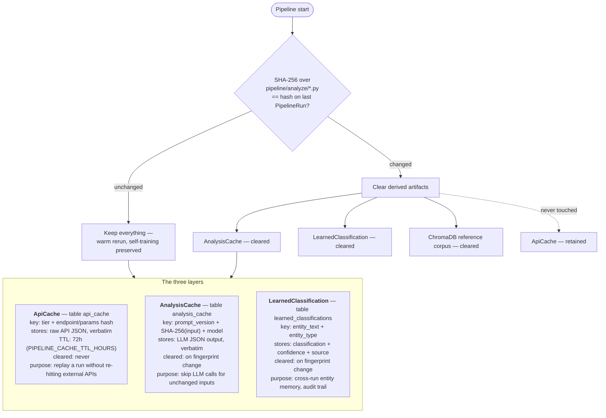

# Caching

Three independent caches with different lifetimes and different invalidation
rules. The distinction that matters: **source data doesn't become wrong when
analysis code changes.**

## Why `ApiCache` is never cleared

It holds immutable source data — what Congress.gov actually returned on a given
day. A fresh run can replay deterministically against those stored responses
instead of re-hitting rate-limited APIs, which is what makes debugging and
auditing a past run possible at all. Entries are re-fetched after the 72h TTL,
not deleted.

Clearing it on a code change would mean a bug fix in scoring costs you the
ability to reproduce yesterday's run.

## The LLM cache key includes the model

`_make_input_hash(prompt_version, input_data, model)` folds the resolved model
name into the hash, so switching model tiers can never serve a generation
produced by the other one.

This has a sharp edge worth knowing about: on the `llama-server` backend the
model argument reaches the *cache key* but not the *request*, so setting
`OLLAMA_STORY_MODEL` there invalidates cached generations and produces fresh
ones from the same 1.2B model — which can look like the larger model took
effect. See [issue #308](https://github.com/kamoras/civitas/issues/308).

## Cache-hit accounting

`ollama_client` tracks calls, hits and misses per `prompt_version`, exposed
through the admin dashboard. A cold full run is 4–6 hours; a warm rerun against
populated caches is 45–90 minutes, and most of that difference is these three
layers.

## Source map

| Concern | Code |
|---|---|
| Cache tables | `backend/app/models.py` — `ApiCache`, `AnalysisCache`, `LearnedClassification` |
| API-response caching | `backend/app/pipeline/cache.py` |
| LLM caching + hashing | `analyze/ollama_client.py` — `_make_input_hash`, `get/set_cached_llm_result` |
| Fingerprint gate | `backend/app/pipeline/run_checks.py` |
| Reference corpus | `analyze/bill_learning.py`, `pipeline/vector_store.py` |
