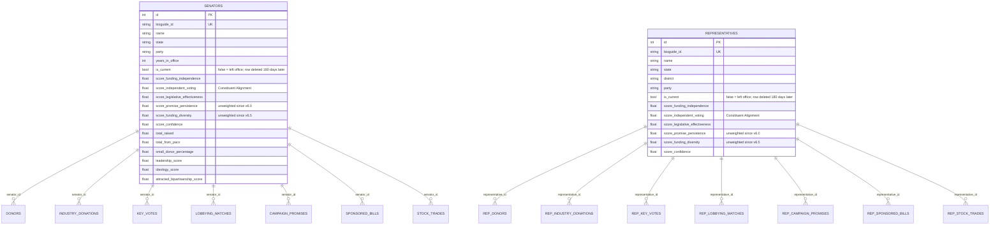
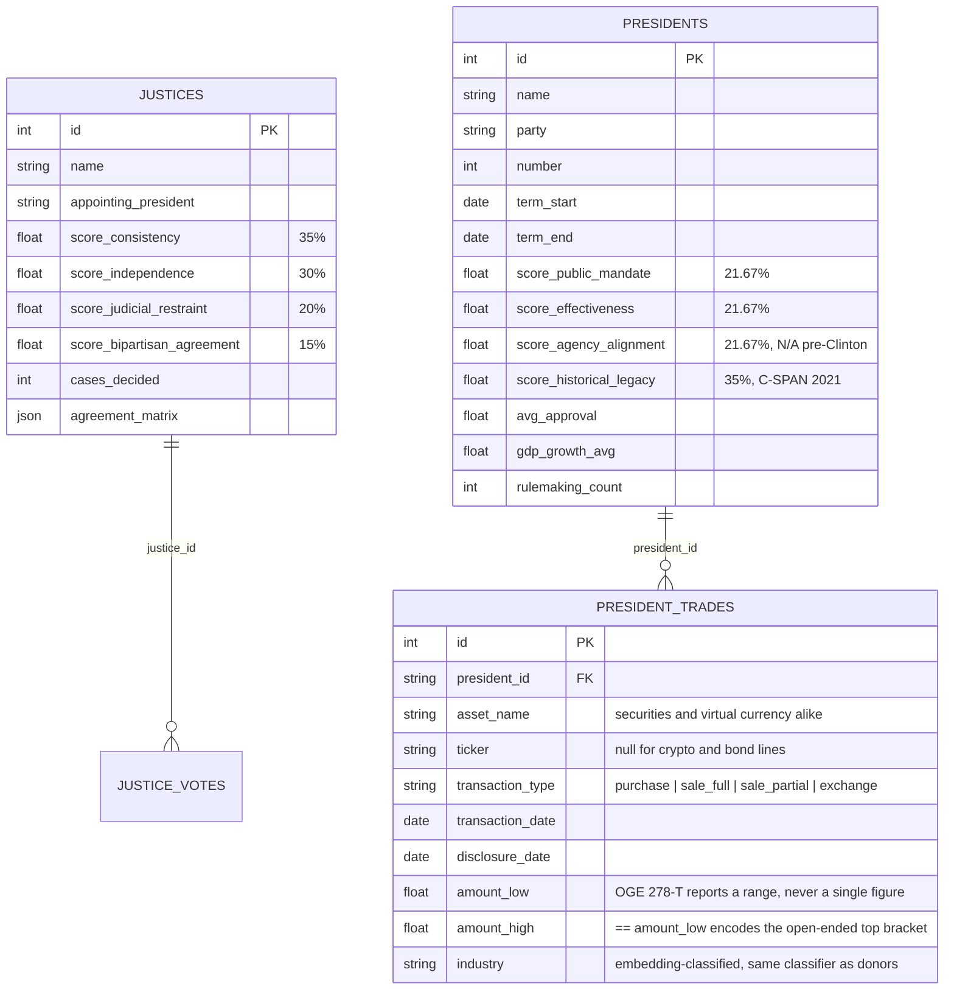
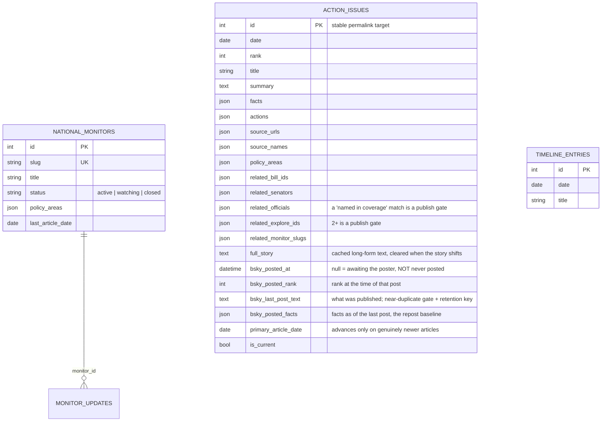
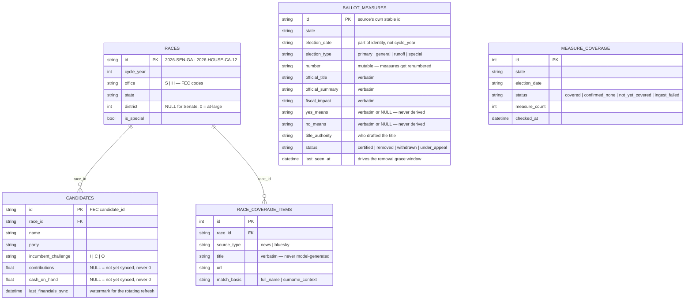
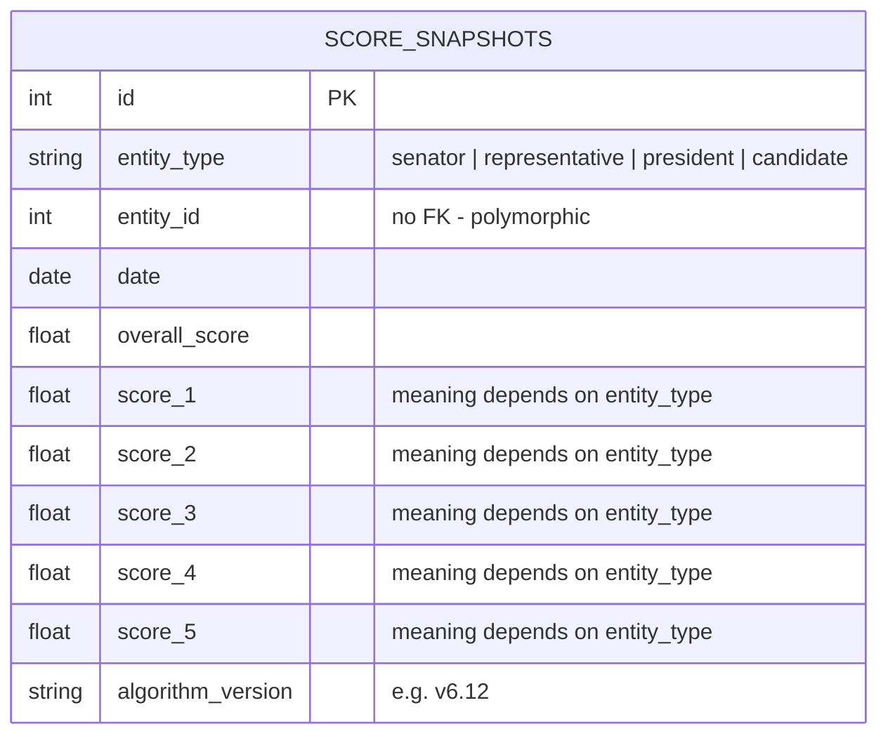

# Data model

45 tables in one SQLite file (`/data/civitas.db`), plus a separate sqlite-vec
file (`/data/vectors.db`) holding the `vec_explore` and `vec_bills` vector
tables — split out for writer-lock isolation, not just tidiness. Shown here in clusters; infrastructure tables are listed rather
than drawn.

**Columns are a selection, not the full schema.** Each entity draws enough to
follow its relationships and the behavior these diagrams discuss, not every
column on the table — `backend/app/models.py` is the authority. An undrawn
column is one these diagrams don't need, not one that doesn't exist.

## Members of Congress

Senators and representatives have **parallel, mirrored table sets**. The
`Representative` side duplicates the `Senator` side rather than sharing a
polymorphic parent — separate tables, identical `score_*` column names, so one
weight map covers both entity types.

## Other scored entities

## Action Center

`ACTION_ISSUES` has no foreign keys to bills or members: `related_bill_ids`,
`related_senators` and `related_monitor_slugs` are JSON arrays of soft
references, populated by semantic search during the ENRICH step. They are
matches, not integrity constraints — the pipeline should not fail because a
linked bill was renumbered.

`WEEK_SUMMARIES`, `MONTH_SUMMARIES` and `YEAR_SUMMARIES` roll up
`TIMELINE_ENTRIES` at period boundaries with no FK, keyed by period.

**`bsky_posted_at` is not a "has this been published" flag**, and reading it as
one is a live bug source. It means "the poster has nothing queued for this
issue": the repost path clears it back to NULL to hand a published issue *back*
to the poster, so a row that published, was flagged for a repost, then failed to
publish the update (two grounding rejections, a publish error) or stopped being
matched sits at NULL with a real post live in the feed. The 14-day cleanup of
old issues therefore keys on `bsky_last_post_text`, which is only ever written
on a successful publish and never cleared — the honest record of "readers have a
URL for this". Near-duplicate suppression leaves it NULL on purpose: nothing was
published, so there is no permalink to protect and the row is free to age out.

## Elections and ballots

Three modelling decisions here are load-bearing rather than incidental:

- **`BALLOT_MEASURES` has no relationship to `RACES`.** Measures and candidate
  contests are independent things that happen to share a ballot, and the state
  ballot endpoint assembles both by `state` rather than joining them.
- **The key is `(state, election_date, number)`, not cycle year.** Ohio can run
  an "Issue 1" in a May primary and a different "Issue 1" in November; a
  cycle-year key collides them and the later sync overwrites the earlier
  measure's text.
- **`MEASURE_COVERAGE` exists so absence can explain itself.** Without it, "this
  state has no statewide measures" and "we have not ingested this state" are the
  same empty list — and on a page about somebody's ballot those are very
  different claims. See AGENTS.md principle 7.

## Score history

One row per entity per run, carrying the algorithm version that produced it —
that last column is what stops the trend charts from comparing scores across
formula changes as though they were the same measurement.

**The numbered columns are a shared slot layout, not fixed dimensions.** Four
different writers use this table and each maps the slots differently, so reading
`score_3` without first checking `entity_type` will give you the wrong number:

| `entity_type` | `overall_score` | `score_1` | `score_2` | `score_3` | `score_4` | `score_5` |
|---|---|---|---|---|---|---|
| `senator`, `representative` | weighted overall | funding independence | promise persistence | constituent alignment | funding diversity | legislative effectiveness |
| `president` | weighted overall | public mandate | effectiveness | *retired* — always 0.0 | agency alignment | historical legacy |
| `candidate` | cash on hand | contributions | disbursements | — | — | — |

Three things worth knowing about that table:

- **`score_3` is a retired slot for presidents.** It held Competence until that
  dimension was removed in 2026-07, and has been 0.0 since. The slot was retired
  in place rather than reindexing every other dimension's historical rows.
- **The columns are `NOT NULL`,** so a president dimension that is genuinely
  inapplicable is stored as `0.0` here. That is not a score of zero — the
  authoritative "does this apply" answer always lives on the `presidents` row's
  own nullable column, never on the snapshot.
- **`candidate` rows aren't scores at all.** The election pipeline reuses the
  table as a financial time series, so `overall_score` is dollars of cash on
  hand. Rows are only written when a value actually changed.

## Not drawn

| Table | Purpose |
|---|---|
| `explore_documents` | Hybrid search corpus; source of truth for the vector index, the FTS5 keyword index, and citation authority — see [09](09-explore-search.md) |
| `api_cache`, `analysis_cache`, `learned_classifications` | See [06 — Caching](06-caching.md) |
| `pipeline_runs`, `house_pipeline_runs`, `supplementary_pipeline_runs`, `stock_trades_pipeline_runs`, `election_pipeline_runs` | Per-pipeline run bookkeeping; `pipeline_runs.status` also serves as the concurrency mutex |
| `bsky_senator_spotlights` | Which senator has been spotlighted, to cycle without repeats |

## Migrations

Lightweight and hand-rolled in `backend/app/database.py` — additive column
checks at startup rather than Alembic. Suits a single-node deployment with one
writer; see `tests/test_db_migrations.py` for the cases covered.

## Source map

All models: `backend/app/models.py`. Response shapes: `backend/app/schemas.py`.
