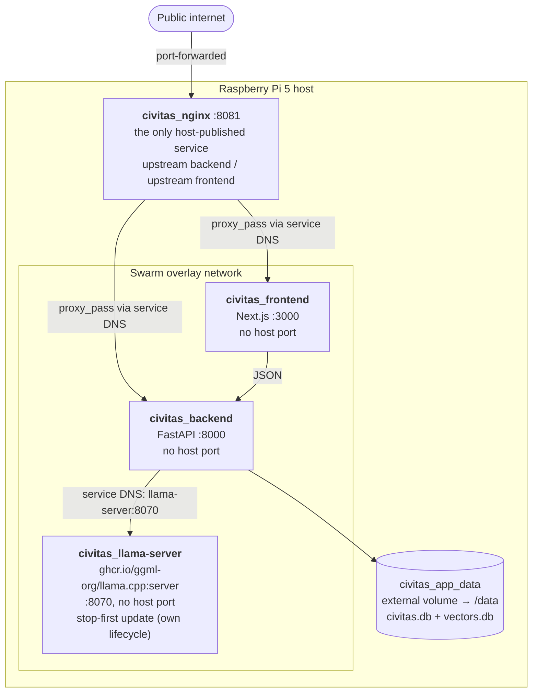
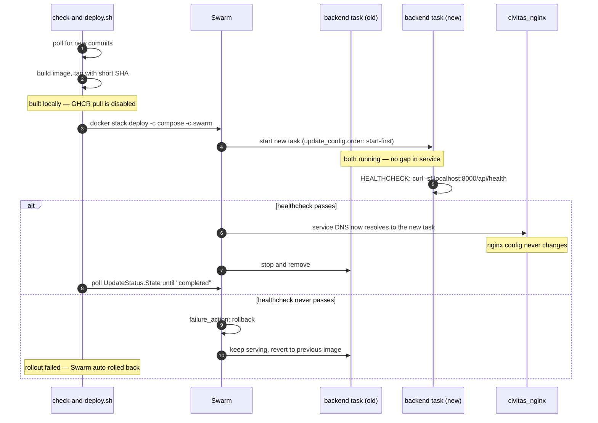

# Deployment

Single-node Docker Swarm. Zero-downtime comes from Swarm's own rolling-update
mechanism, not a hand-rolled blue/green script — that script was retired in
2026-07.

## Topology

**Backend and frontend publish no host port.** Swarm's host-mode publishing
cannot bind to `127.0.0.1` the way `docker run -p 127.0.0.1:PORT:PORT` can — it
always binds `0.0.0.0` (confirmed live). Rather than accept LAN-wide exposure of
ports that were loopback-only before, they simply aren't published. nginx,
inside the same overlay network, is the only path to either.

**The volume is `external: true`**, so `docker stack deploy` never recreates or
touches it. Both SQLite files (`civitas.db`, `vectors.db`) survive image rebuilds and
stack redeploys.

**llama-server is its own Swarm service** with its own rolling-update
lifecycle (`stop-first`, unlike backend/frontend's `start-first` — see
docker-compose.swarm.yml for why), so model weights don't reload every
time backend redeploys, only when llama-server's own image/config
changes. Runs the official `ghcr.io/ggml-org/llama.cpp:server` image,
pinned by digest; Dependabot bumps it like any other dependency
(2026-08-29: live-benchmarked against a from-source ARM-optimized build
on this same Pi — generation speed was identical, prefill ~12% slower,
not worth losing automatic updates over). If it's unreachable, LLM calls
time out and the pipeline records a per-member failure without aborting
the run.

## Rolling update

Health is judged purely on the Docker `HEALTHCHECK` exit code — the same
"HTTP 200, don't parse the body" criterion the old deploy script used. The
`database` and `ollama` fields in the response body are informational for the
admin dashboard and do not gate the rollout.

`ollama` is a historical key name (Ollama isn't bundled in the stack
anymore): it reports whichever backend `LLM_BACKEND` selects, so under the
default it is llama-server's health.

Deploying restarts the backend, which kills any in-flight pipeline run — hence
the stale-run detection in [02](02-nightly-pipeline.md).

## Service reference

| Host port | Swarm service | Purpose |
|---|---|---|
| 8081 | `civitas_nginx` | Reverse proxy + caching. The only published port — don't change without updating the external forwarding rule. |
| — | `civitas_backend` | FastAPI, overlay-network only |
| — | `civitas_frontend` | Next.js, overlay-network only |
| — | `civitas_llama-server` | llama.cpp inference, overlay-network only |

`docker swarm init` is a one-time host setup step, not part of any deploy
script.

## Source map

| Concern | File |
|---|---|
| Deploy poller | `check-and-deploy.sh` (+ `check-and-deploy.test.sh`) |
| Base stack | `docker-compose.yml` |
| Swarm overlay | `docker-compose.swarm.yml` |
| Local dev overrides | `docker-compose.dev.yml` |
| Reverse proxy | `nginx/civitas.conf` |
| Health endpoint | `backend/app/api/health.py` |
