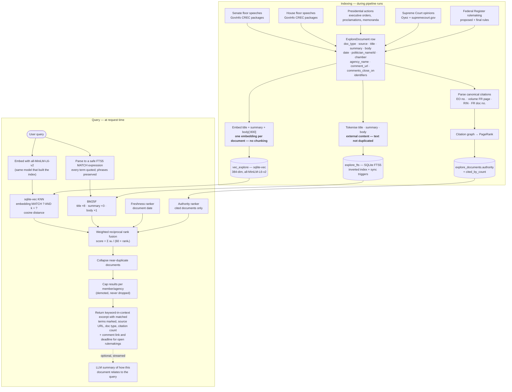

# Explore — hybrid search

Free-text search over primary-source government documents. Two independent
retrieval channels — a sentence-transformer index and a BM25F inverted index —
combined with two query-independent priors by reciprocal rank fusion. All
three index structures are derived from the `explore_documents` table and are
rebuilt from it at the end of every ingest run.

Filters — document type, chamber, politician, open-for-comment — are pushed
into **both** channels rather than applied to their output. Post-filtering is
how a chamber-scoped search ends up with three results out of a requested
thirty.

## Design notes

**Two retrieval channels, because they fail in opposite directions.** A
384-dimensional bi-encoder embeds "Executive Order 14110" and "Executive Order
13985" to nearly the same point: the number carries the meaning and the model
never saw it. The same failure covers docket numbers, RINs, agency acronyms,
statutory citations, and member surnames — and those are precisely the queries
where the user knows exactly what they want. Classical inverted-index
retrieval is best at exactly those and weakest where the embedding is strong
(paraphrase, synonymy, topical queries). This is why the answer to "search
isn't finding things" was a second channel and not a bigger embedding model.

**Rank fusion, not score blending.** Cosine distance and Okapi BM25 are not
comparable quantities, and the usual fix — min-max normalise each, then add —
makes the blend depend on whatever the best and worst scores happened to be
for that one query. Reciprocal rank fusion (Cormack, Clarke & Büttcher, SIGIR
2009) discards the scores and fuses the *rankings*, `score(d) = Σ wᵣ / (K +
rankᵣ(d))` with K = 60. A ranker that did not return a document contributes
nothing for it — which is also what lets the two priors sit in the same sum as
extra voters. The weights are in `config_definitions.py` under "Explore search
ranking".

**The priors are weighted against the relevance evidence present.** Both
retrieval channels together contribute a combined weight of 2.0, so a
freshness voter of 0.4 is one fifth of the relevance mass. When one channel
returns nothing — its index rebuilding, or simply no keyword match for this
query — that mass halves while a fixed prior does not, and recency and
authority double in relative influence exactly when the engine can least
afford it. `hybrid_search` therefore scales the prior weights by the number
of channels that returned candidates, so how far recency can reach does not
depend on which indexes happen to be up.

This was found by measuring, not by reading. On a 93-document corpus with
the semantic channel unavailable, the same queries scored:

| configuration | MRR | R@1 |
|---|---|---|
| retrieval only (keyword) | 0.978 | 0.962 |
| hybrid, fixed priors | 0.752 | 0.613 |
| hybrid, scaled priors | 0.850 | 0.732 |

A third of top hits displaced by recency, inside the degraded mode this
feature otherwise advertises as a benefit. Hybrid sits below retrieval-only
in both rows because known-item retrieval scores query-independent priors
that way by construction — the 0.752 → 0.850 recovery is the signal, not
the gap to 0.978.

**Recency is a voter, not a sort.** At K = 60 a weight-`w` voter's whole swing
is about `w/(K+1)`, so at 0.4 the entire freshness signal is worth roughly the
distance between rank 1 and rank 40 of one retrieval channel. It can lift a
markedly newer document over a slightly more relevant one and cannot flip an
adjacent pair — the division of labour `tests/test_explore_search.py` pins
down in both directions.

**The authority pass streams bodies rather than reading them.** The citation
graph is built from two queries: one over the small columns to map identifiers
to documents, and one that streams bodies in batches into the extractor and
discards each after use. Reading it all in one pass would hold the corpus's
entire body text resident next to two sentence-transformer models. `yield_per`
alone does not achieve that — it batches the *fetch*, and accumulating the rows
it yields puts every body straight back in memory.

**Citation authority is the PageRank analogue, and it is opt-in.** Federal
documents cite each other constantly and by canonical identifier; those
formats are published in the Office of the Federal Register's Document
Drafting Handbook, so they are *parsed*, not classified. A document only
enters the authority ranking if the corpus actually cites it. That matters
because citability is unevenly distributed by document type — a Federal
Register rule carries an FR citation the next rule can point at, a floor
speech carries nothing anyone cites. Ranking uncited documents at the bottom
of an authority ordering, rather than leaving them out of it, would quietly
demote every speech in the corpus on every query. On a corpus too new to have
accumulated cross-references, nobody clears the bar and the prior does nothing
at all — the correct failure mode for a signal like this.

**Near-duplicates are collapsed, crowding is demoted.** This corpus is known
to accumulate byte-identical rows (a 2026-07 audit found 1,758 of them, 31% of
the table), and the Congressional Record legitimately reprints text.
Duplicates collapse to their best-ranked copy *after* fusion, so the survivor
is the one the rankers liked, and the result reports how many were folded in.
Separately, no single member or agency may take more than three of the leading
results before the rest are demoted below other sources — they are moved, not
dropped, so a member-scoped search still returns everything it found.
Deduplication keys on a normalised content fingerprint rather than the title:
every one of a member's floor speeches shares the same generated title, so a
title-based rule would return exactly one of them.

**"Newest" means newest matching.** The date sort orders the whole filtered
candidate pool, not the relevance page. The candidate pool is deliberately
several times the page size for the same reason the filters are pushed down:
sorting the twenty most similar documents by date answers a question nobody
asked.

**Excerpts are marked with control characters, not markup.** The keyword
channel returns a keyword-in-context snippet with matched terms wrapped in
U+0002/U+0003. A verbatim slice of a Federal Register body has no business
being parsed as HTML, and `<b>` would have to be either escaped (showing users
literal tags) or trusted. The frontend splits on the sentinels and builds
`<mark>` elements, so nothing on this path needs `dangerouslySetInnerHTML`.

**No chunking, still deliberately.** One embedding per document over
`title + summary + body[:800]`. Chunking would improve recall on long
documents but multiplies index size and query cost — a real constraint when
the whole index lives on a Pi alongside two embedding models. The disclosed
trade is narrower than it was: the keyword index reads the *entire* body, so a
term appearing past 800 characters is now reachable by the keyword channel
even though the embedding never saw it. What remains unreachable is a
*paraphrase* of a passage that far in.

**Half the engine can be down and search still works — and says so.** The
vector index records which model built it, and a mismatch at startup drops the
vec tables and kicks off a background reindex that takes minutes on the Pi.
Search used to return "index not ready" for that entire window; it now serves
keyword results. The endpoint returns the 503 "still indexing" contract only
when *neither* channel can answer — which includes a query with no keyword
match while the vector index is down, since in that state the endpoint
genuinely cannot claim the corpus has no match.

Partial answers are labelled as partial. The response carries
`semanticUnavailable`, and the page tells the reader they are seeing keyword
matches only while the meaning-based index rebuilds. That flag is deliberately
*not* `channels.semantic == 0`: a filtered query can retrieve zero vectors from
a perfectly healthy index, and conflating the two would announce a rebuild
every time a document-type filter came up empty on the semantic side.

The keyword index has the same story on the way in. Its table and triggers are
created synchronously at startup, so every write from that moment is indexed,
but the *backfill* of rows that predate the index runs on a background thread —
re-tokenising a full corpus inside `init_db()` would hold up the FastAPI
lifespan and the container health check on the one deploy that introduces it.
On a fresh database there is nothing to backfill and no thread is started.

**The FTS index is external-content, with a nightly rebuild as the backstop.**
`content='explore_documents'` means the inverted index stores no copy of the
document text. The cost is that the sync triggers' `'delete'` command corrupts
the index silently if it is ever handed values that differ from what was
indexed — and the ingest pipeline rewrites bodies in place during backfill. A
full re-tokenise at the end of every run makes any drift self-healing within a
day.

**Bill text is not in this index.** Explore covers primary-source *government
activity* documents. Bill text is used separately, title-only, for the tier-3
kNN bill-classification step in the scoring pipeline
([04 — Classification tiers](04-classification-tiers.md)). Two different
corpora for two different jobs.

**The index is not built with the classification model.** Indexing and
querying both use `all-MiniLM-L6-v2`, while bill/donor classification stays on
`Snowflake/snowflake-arctic-embed-xs`. Arctic is retrieval-*asymmetric* and
packs same-register text into a narrow ~0.55-0.87 raw-cosine band, which left
several similarity gates unable to separate real matches from noise; MiniLM
measured roughly 4x the separation margin on document anchoring against this
platform's own live failure cases. Classification stays on Arctic because its
thresholds were calibrated against that model's geometry. Both are ~22M
parameters and 384-dim, so carrying two costs little.

**Open rulemakings are a first-class filter.** Federal Register documents
still open for public comment carry `comment_url` and `comments_close_on`, and
the result surfaces both — the one place on the platform where search leads
directly to an action with a deadline.

**Summarisation is on-demand and streamed.** It uses `stream_llm` rather than
`call_llm`, so text renders progressively; the call site handles its own
caching and retry, because "retry" means something different once a partial
response is already on screen.

## Measuring changes

Ranking weights are a tuning surface, and "this looks better" is how a ranking
function accumulates changes nobody can defend.
`backend/scripts/evaluate_explore_search.py` reports MRR and Recall@1/5/20 for
the semantic channel, the keyword channel, and the fusion, broken out by query
style:

| Style | Query built from | What it probes |
|---|---|---|
| `title` | the document's own title | the easy case |
| `paraphrase` | body content words, title words removed | where dense retrieval should win |
| `identifier` | serial numbers and citations in the document | where dense retrieval cannot compete |
| `rare` | the document's least common terms corpus-wide | the long tail, where IDF earns its keep |

Relevance judgments are derived, not hand-labelled: this is known-item
retrieval, where a document is pulled from the corpus, a query a person
looking for *that* document might plausibly type is built from it, and the
measurement is how far down the results it appears. The document is the only
correct answer by construction. That measures one thing well — can the engine
find a document someone is looking for — and deliberately says nothing about
whether a broad topical query returns a good *set*, which needs real labels.
