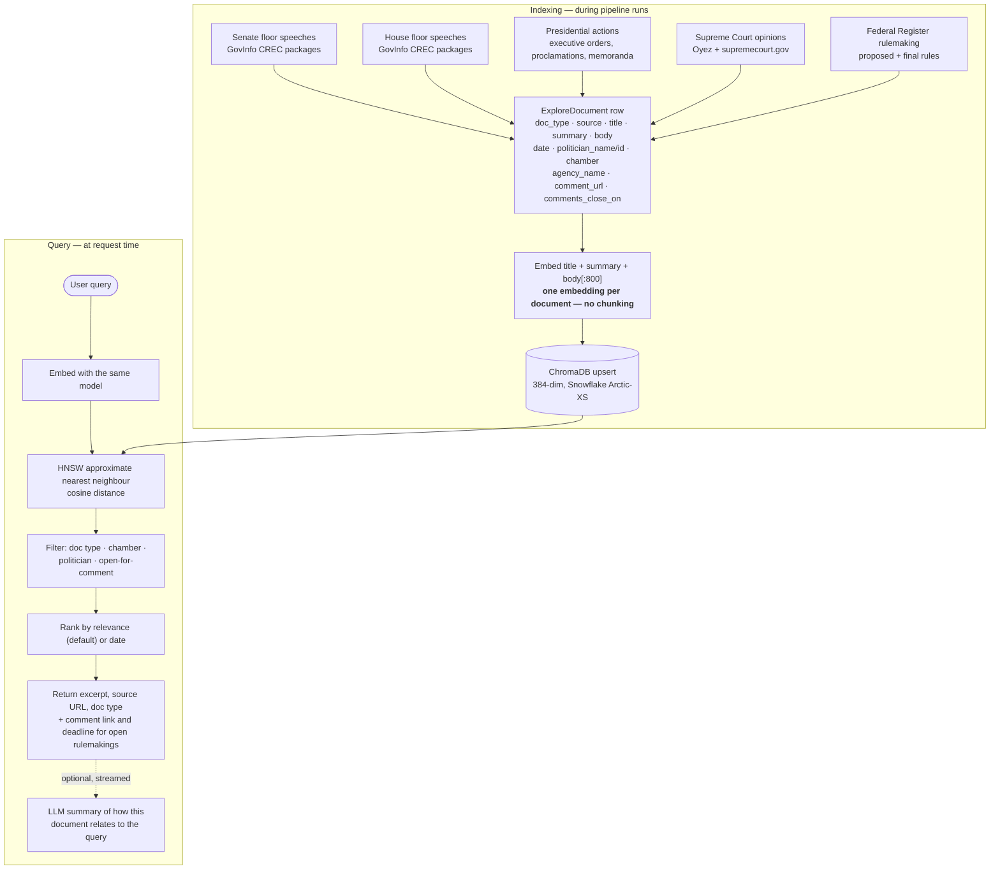

# Explore — semantic search

Free-text search over primary-source government documents, with no keyword
matching. Documents are embedded offline during pipeline runs; queries are
embedded at request time.

## Design notes

**No chunking, deliberately.** One embedding per document over
`title + summary + body[:800]`. Chunking would improve recall on long documents
but multiplies index size and query cost — a real constraint when the whole
index lives on a Pi alongside everything else. The truncation is a disclosed
trade: a document whose relevant passage sits past 800 characters of body may be
missed.

**Bill text is not in this index.** Explore covers primary-source *government
activity* documents. Bill text is used separately, title-only, for the tier-3
kNN bill-classification step in the scoring pipeline
([04 — Classification tiers](04-classification-tiers.md)). Two different
corpora for two different jobs.

**The same embedding model serves both.** Snowflake Arctic-XS, 22M parameters,
already loaded in-process for classification. No second model is needed.

**Open rulemakings are a first-class filter.** Federal Register documents still
open for public comment carry `comment_url` and `comments_close_on`, and the
result surfaces both — the one place on the platform where search leads
directly to an action with a deadline.

**Summarisation is on-demand and streamed.** It uses `stream_llm` rather than
`call_llm`, so text renders progressively; the call site handles its own caching
and retry, because "retry" means something different once a partial response is
already on screen.

## Why dense retrieval over BM25

Keyword search fails on conceptual queries where exact term overlap is low —
"climate policy" against a document that says "greenhouse gas emissions
standards" scores near zero on BM25 and high on cosine similarity in embedding
space (Karpukhin et al. 2020, dense passage retrieval).

## Source map

| Concern | Code |
|---|---|
| Indexing pipeline | `backend/app/pipeline/explore_pipeline.py` |
| Vector store | `backend/app/pipeline/vector_store.py` |
| Query API | `backend/app/api/explore.py` |
| Public search endpoint | `GET /api/public/v1/search` |
| Document model | `backend/app/models.py::ExploreDocument` |
| Frontend | `frontend/src/app/explore/` |
