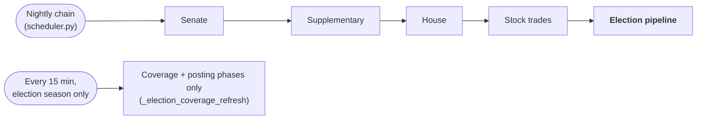
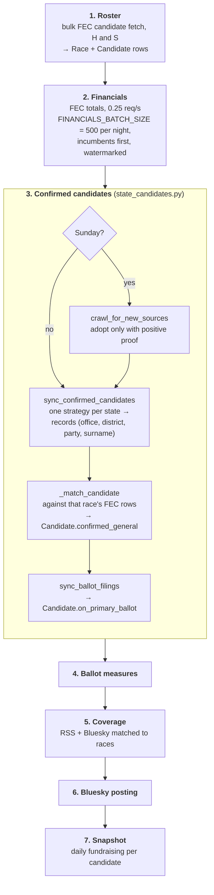
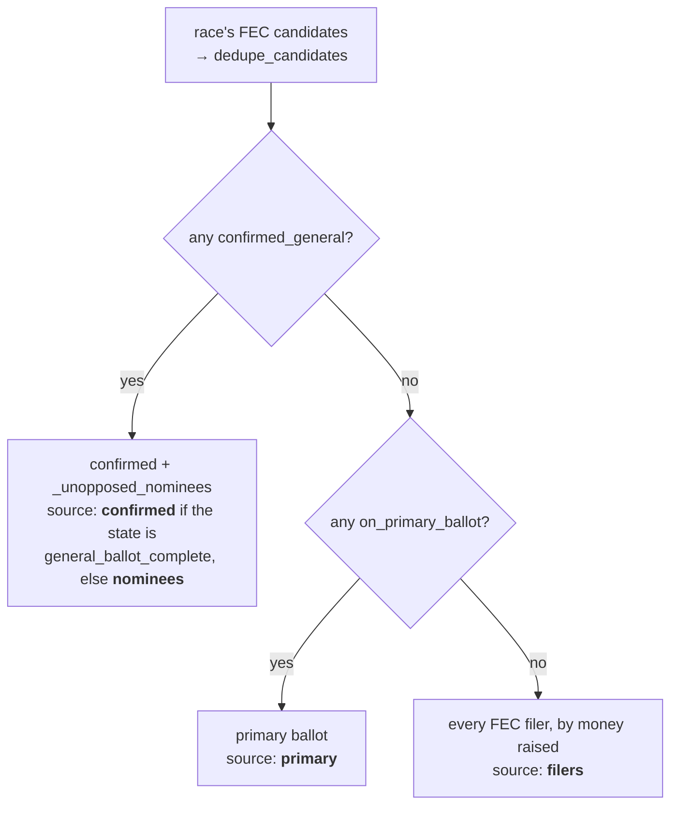

# Elections

How a state ballot page gets from "everyone who filed with the FEC" to "who
is actually on your November ballot", and what the page says when it can't.

Code: `backend/app/pipeline/election_pipeline.py` (the run),
`backend/app/pipeline/fetch/state_candidates*.py` (per-state sources),
`backend/app/data/state_candidate_sources.json` (which source each state
uses), `backend/app/api/elections.py` (what a page is allowed to show).

## When it runs

The election pipeline is last in the nightly chain, so an earlier pipeline
that aborts the chain also skips it — check `election_pipeline_runs` after
any nightly interruption.

## The run

Phases are `ELECTION_PIPELINE_STEPS` in `election_pipeline.py`. Each one
catches its own failure and the run continues, so one broken source never
blanks a page.

## Where "confirmed" comes from

Every state has exactly one entry in `state_candidate_sources.json`. What
matters is not the vendor but **what kind of document** the strategy reads,
because that decides what the page can honestly claim.

| Source kind | What it can see | States (2026-09-26) |
|---|---|---|
| **Certified general ballot** | Everyone on the November ballot, third parties and independents included | TX (`tx_civix`), NC (`tabular` + filing list), SD (`sd_vip`), LA (`voterportal`), SC (`vrems`), MO (`certified_pdf`) |
| **Primary results** | Each party's nominee. Cannot see a Libertarian, Green or independent who never ran in a primary | the other 38 configured states — `tabular` (14), `clarity` (3), `tally_enr` (2), `totalvote_enr` (2) and 17 single-state strategies |
| **National fallback** | Nothing until Google publishes general-election contests, close to the election | MI, NV, NY, OH, OK, WI (`google_civic`) |

The first row is the states flagged `general_ballot_complete`. Transcribed
from the JSON on the date shown; the JSON is authoritative.

**Prefer the ballot over results wherever a state publishes it.** Results
have to be *interpreted* — runoff thresholds, top-two, certification flags —
and can still be wrong: South Carolina's June primary winner for Senate was
later replaced as nominee through a special primary and runoff, so a
results reader stopping at June publishes the wrong person. A certified
ballot needs no interpretation.

**Why the six are on the fallback.** Their election sites answer server
requests with a bot challenge (Cloudflare: NY, MI, WI; Incapsula: NV;
Ohio's SOS hosts return a "maintenance" 403), and Oklahoma's results API
needs a login with a credential embedded in its page script. The pipeline
does not defeat bot protection or use credentials not issued to it. The
same office often publishes plain files on an open path — Wisconsin's
official canvass PDF is one — and that is the way in.

### Rules every strategy follows

- **Federal contests only, recognised positively** (`parse_office`). Anything
  not explicitly federal is refused — Rhode Island's *state* Senate is
  "Senator in General Assembly".
- **None is not []**. A fetch that failed returns `None` (the state is
  reported as failing); a source that genuinely lists nobody returns `[]`.
  A dead source must never read as "nobody is running".
- **No pinned election ids.** A source finds this cycle's election by the
  statutory general-election date (`fec.general_election_day`), a `{year}`
  link pattern, or a landing page — so the next cycle needs no edit.
- **Certification is a signal, not a promise.** `require_official` where a
  vendor flags it, with `settle_days` (default 30, `state_candidates_tabular.py`)
  underneath, because the flag is not reliably flipped.

### Matching a record to an FEC candidate

`_match_candidate` works inside one race's candidate list, by surname:

1. Surname via `candidate_dedup.normalized_surname`, which strips a
   generational suffix FEC sometimes files on the surname (`CLEAVER II, EMANUEL`).
2. Multi-word FEC surnames fall back to their last token (`WASSERMAN SCHULTZ`).
3. Several matches → the one whose party matches.
4. Identical name **and** party → one person filed under two FEC ids;
   confirm the record that raised money.
5. Still ambiguous → the given name decides, or nothing is confirmed.

A ballot candidate with **no FEC filing** matches nothing and cannot be
shown, because race lists are built from FEC rows. Known gap: 7 of
Louisiana's 41 federal ballot candidates on 2026-09-26.

## What a race shows

`_confirmed_or_all` and `_candidate_source` in `api/elections.py`.
`_unopposed_nominees` restores candidates a results file cannot see because
their uncontested primary was never held — without it, 36 real candidates,
19 of them sitting members of Congress, were dropped.

`_ballot_basis` reports the **weakest** source across a state's races plus
whether its primary has passed. The state page leads with it
(`BallotBasisNotice`): filers after a primary get the loudest notice on the
page ("these are not ballot positions"); a certified ballot gets none.

## Finding your district

Civitas never asks for an address. The House section offers three ways in,
none of which sends anything anywhere:

- **District map** (`DistrictMap.tsx`) — the state's districts from the
  Census 119th-Congress boundary file, vendored per state under
  `frontend/public/data/cd/` by `backend/scripts/build_district_topology.py`,
  which refuses to write unless every district matches
  `county_district_crosswalk.json`.
- **County picker** (`DistrictFinder.tsx`) — built from the counties each
  race already lists; a county split between districts offers them.
- **Text filter** — counties or the sitting representative's name.
