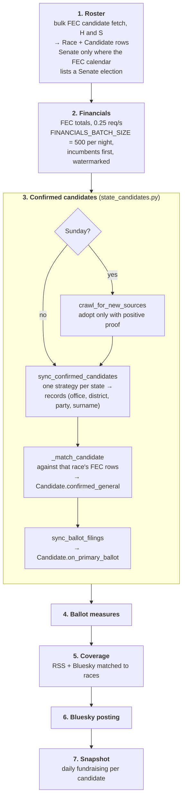
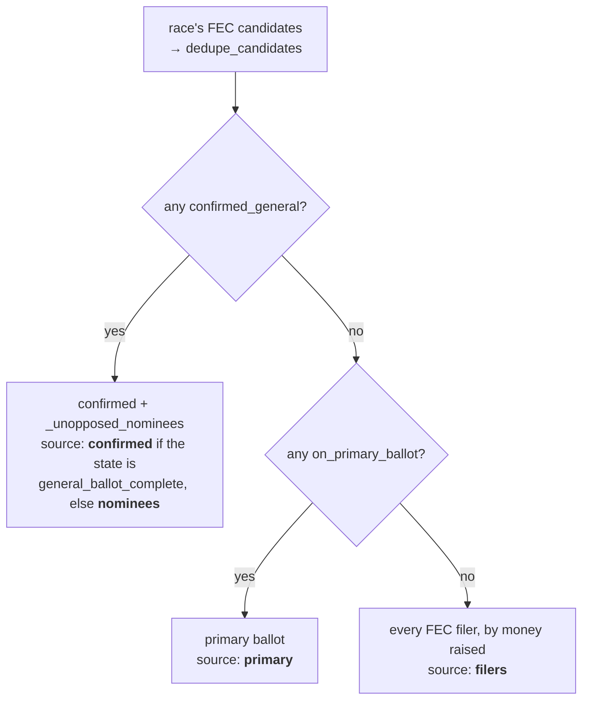

# Elections

How a state ballot page gets from "everyone who filed with the FEC" to "who
is actually on your November ballot", and what the page says when it can't.

Code: `backend/app/pipeline/election_pipeline.py` (the run),
`backend/app/pipeline/fetch/state_candidates*.py` (per-state sources),
`backend/app/data/state_candidate_sources.json` (which source each state
uses), `backend/app/api/elections.py` (what a page is allowed to show).

## When it runs

The election pipeline is last in the nightly chain, so an earlier pipeline
that aborts the chain also skips it — check `election_pipeline_runs` after
any nightly interruption.

## The run

Phases are `ELECTION_PIPELINE_STEPS` in `election_pipeline.py`. Each one
catches its own failure and the run continues, so one broken source never
blanks a page.

A Senate race is created only where the FEC election-dates calendar lists a
Senate general for the state (`state_election_dates.senate_election_known`).
Filers anywhere else are skipped and races already on file are removed —
New York and Hawaii had phantom "special elections" in 2026 built from
serial filers. Until the calendar has been read once, the class rotation
decides.

## Where "confirmed" comes from

Every state has exactly one entry in `state_candidate_sources.json`. What
matters is not the vendor but **what kind of document** the strategy reads,
because that decides what the page can honestly claim.

| Source kind | What it can see | States (2026-09-26) |
|---|---|---|
| **Certified general ballot** | Everyone on the November ballot, third parties, independents and post-primary replacements included | TX (`tx_civix`), NC (`tabular` + filing list), SD (`sd_vip`), LA (`voterportal`), SC (`vrems`), MO (`certified_pdf`); and as a `general_list` beside a primary-results source: ME, CO, VA, TN, MD, IA, NE (`certified_table`, spreadsheets and PDF tables), FL (`dos_canlist`), NJ (`nj_certification` official lists) |
| **Primary results** | Each party's nominee. Cannot see a Libertarian, Green or independent who never ran in a primary, or a nominee replaced after the primary | the other 33 configured states — `tabular` (14), `clarity` (2), `tally_enr` (2), `totalvote_enr` (2) and 13 single-state strategies (WI's `canvass_summary_pdf` among them) |
| **National fallback** | Nothing until Google publishes general-election contests, close to the election | MI, NV, NY, OH, OK (`google_civic`) |

The first row is the states flagged `general_ballot_complete`. Transcribed
from the JSON on the date shown; the JSON is authoritative.

**Prefer the ballot over results wherever a state publishes it.** Results
have to be *interpreted* — runoff thresholds, top-two, certification flags —
and can still be wrong. Maine's Democratic Senate primary winner (Graham
Platner) withdrew in July and the party nominated Troy Jackson by
convention; South Carolina's June Senate winner was replaced through a
special primary and runoff. A results reader publishes the wrong person in
both. A certified ballot needs no interpretation.

**A certified ballot is authoritative.** `confirmed_general` is never
cleared for a primary-results state. For a `general_ballot_complete` state,
`_unconfirm_off_ballot` clears it for anyone in a race the list covers who
is not on the list — only after a successful fetch, and only for races the
list covers. For North Carolina the authoritative list is its filing list's
general rows, so this runs in `sync_ballot_filings` rather than after the
primary-results pass.

**Why the five are on the fallback.** Their election sites answer server
requests with a bot challenge (Cloudflare: NY, MI; Incapsula: NV;
Ohio's SOS hosts return a "maintenance" 403), and Oklahoma's results API
needs a login with a credential embedded in its page script. The pipeline
does not defeat bot protection or use credentials not issued to it. The
same office often publishes plain files on an open path — Wisconsin's
official canvass PDF is one — and that is the way in.

**A certified list beside primary results.** A state's `general_list` runs
first; when it answers it alone decides the federal races (authoritative),
while the main source still supplies statewide, legislative and judicial
nominees, and federal nominees before the list is posted. The sync records
which source answered (`_record_ballot_basis`, tier `ballot-basis`), and the
API labels races "confirmed" only when that source was the complete ballot —
never from config alone. `fallback` is different: a whole second source run
only when the main one returns nothing (WI's canvass → Google Civic).

`certified_table` reads a PDF as a table (IA, NE): the row holding every
configured heading is the header, cells split at gaps wider than a space
(`_CELL_GAP`), and each cell goes to the column it starts in — column starts
learned from cells under exactly one heading, since data sits left-aligned
under centred headings. `office_fill_down` carries a once-per-group office
down, set only by candidate rows so a footer or a governor's group never
inherits a congressional district. Scanned certifications (UT's OCR text,
AL's images) are not read: one misread name would unconfirm a real nominee.

### Rules every strategy follows

- **Federal contests only, recognised positively** (`parse_office`). Anything
  not explicitly federal is refused — Rhode Island's *state* Senate is
  "Senator in General Assembly".
- **None is not []**. A fetch that failed returns `None` (the state is
  reported as failing); a source that genuinely lists nobody returns `[]`.
  A dead source must never read as "nobody is running".
- **No pinned election ids.** A source finds this cycle's election by the
  statutory general-election date (`fec.general_election_day`), a `{year}`
  link pattern, or a landing page — so the next cycle needs no edit.
- **Certification is a signal, not a promise.** `require_official` where a
  vendor flags it, with `settle_days` (default 30, `state_candidates_tabular.py`)
  underneath, because the flag is not reliably flipped.

### Matching a record to an FEC candidate

`_match_candidate` works inside one race's FEC rows (never a ballot-only
row), comparing surnames with accents folded and generational suffixes
stripped on both sides:

1. Exact surname.
2. Otherwise, in order, each only if the one before found nobody: the FEC
   surname's last token (`WASSERMAN SCHULTZ`); the state surname's last token
   (Maryland's "McClain Delaney" is `DELANEY, APRIL MCCLAIN`); a surname filed as the last
   given name (`ARENHOLZ, ASHLEY HINSON`); one spelling slip with the given
   name agreeing (`DAUGHTERY` / Daugherty).
3. Several matches → the one whose party matches, then the one whose given
   name matches (TX-34's Eric and Mayra Flores).
4. Same surname, given name and party → one person under two FEC ids;
   confirm the record that raised money.
5. Still ambiguous → nothing is confirmed.

Every strategy returns the printed name (`display_name`) beside the
surname, via `federal_record` in `state_candidates_common.py`.

**A ballot candidate with no FEC filing is still shown.** An unmatched
record with a real printed name (two or more words, not a results file's
"Write-in"/"Scattering" row) becomes a ballot-only `Candidate`: id
`ballot:` + race + name, `fec_filed` False, confirmed. The financial
refresh skips it, and the page shows "no FEC filing" with no FEC link. It
is removed when the state stops listing it, or when the person files and
matches a real FEC row.

## What a race shows

`_confirmed_or_all` and `_candidate_source` in `api/elections.py`.
`_unopposed_nominees` restores candidates a results file cannot see because
their uncontested primary was never held — without it, 36 real candidates,
19 of them sitting members of Congress, were dropped.

`_ballot_basis` reports the **weakest** source across a state's races plus
whether its primary has passed. The state page leads with it
(`BallotBasisNotice`): filers after a primary get the loudest notice on the
page ("these are not ballot positions"); a certified ballot gets none.

## Finding your district

Civitas never asks for an address. The House section offers three ways in,
none of which sends anything anywhere:

- **District map** (`DistrictMap.tsx`) — the state's districts from the
  Census 119th-Congress boundary file, vendored per state under
  `frontend/public/data/cd/` by `backend/scripts/build_district_topology.py`,
  which refuses to write unless every district matches
  `county_district_crosswalk.json`.
- **County picker** (`DistrictFinder.tsx`) — built from the counties each
  race already lists; a county split between districts offers them.
- **Text filter** — counties or the sitting representative's name.

On the national map (`RaceMap.tsx`), the eight states too small to tap —
Rhode Island draws at 4×5 pixels on a phone — also get a labelled box off
the coast joined to the state by a leader line, placed from the map's own
path generator.
