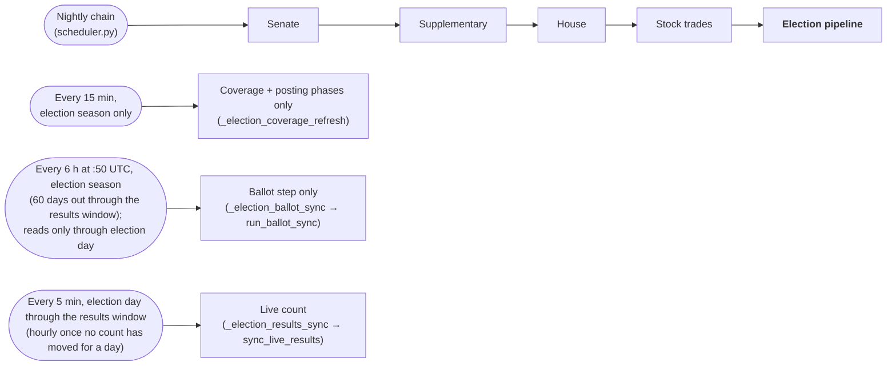
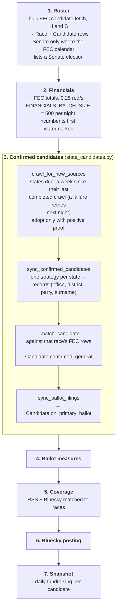
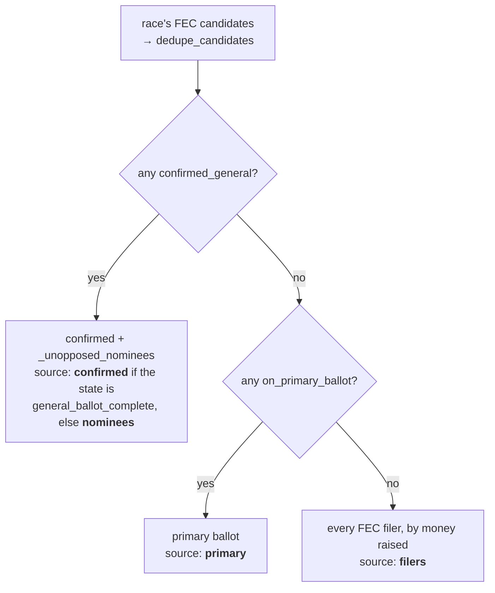
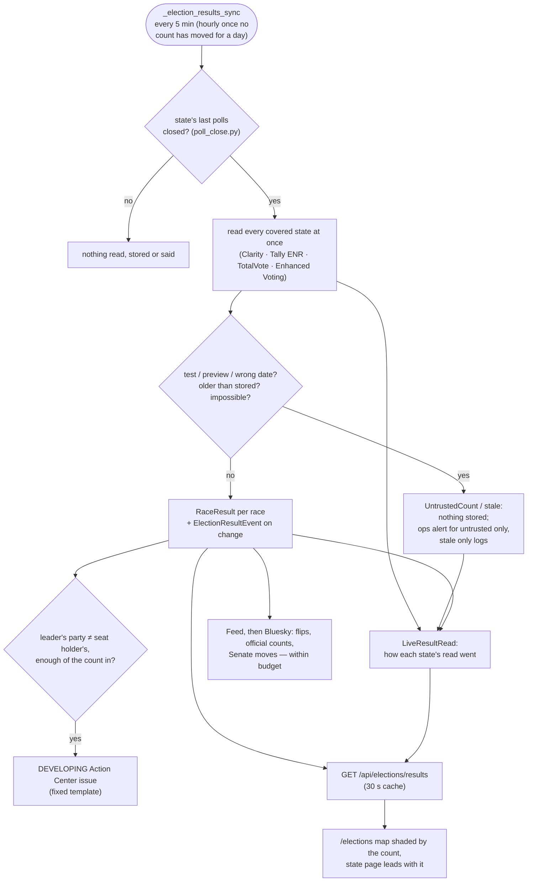

# Elections

How a state ballot page gets from "everyone who filed with the FEC" to "who
is actually on your November ballot", and what the page says when it can't.

Election night has its own section: [The live count](#election-night-the-live-count).

Code: `backend/app/pipeline/election_pipeline.py` (the run),
`backend/app/pipeline/fetch/state_candidates*.py` (per-state sources),
`backend/app/data/state_candidate_sources.json` (which source each state
uses), `backend/app/api/elections.py` (what a page is allowed to show).

## When it runs

```mermaid
flowchart LR
    NIGHTLY(["Nightly chain<br/>(scheduler.py)"]) --> SEN[Senate] --> SUP[Supplementary] --> HOUSE[House] --> STOCK[Stock trades] --> ELEC["<b>Election pipeline</b>"]
    QUARTER(["Every 15 min,<br/>election season only"]) --> COV["Coverage + posting phases only<br/>(_election_coverage_refresh)"]
    SIX(["Every 6 h at :50 UTC, election season<br/>(60 days out through the results window);<br/>reads only through election day"]) --> BAL["Ballot step only<br/>(_election_ballot_sync → run_ballot_sync)"]
    FIVE(["Every 5 min, election day through the results window<br/>(hourly once no count has moved for a day)"]) --> RES["Live count<br/>(_election_results_sync → sync_live_results)"]
```

The election pipeline is last in the nightly chain, hours into the night.
An earlier link that is skipped or fails no longer holds it back
(`pipeline_chain.run_chain`: each link runs whatever the one before did, and
is alerted on its own); only a data reset or a killed process ends the
chain, so check `election_pipeline_runs` after one. In election season (`is_election_season`: the 60
days before an election, and on through its results window) the ballot
step (certified lists / primary results, then filing lists) is also
scheduled on its own every 6 hours, so ballots don't wait most of a day
for the nightly run; it and the nightly ballot phase each step aside while the other is
running. It reads ballots up to and including election day. From the day
after (`election_is_held`) each 6-hour tick still fires through the results
window but returns `skipped` without reading anything, and neither the
nightly ballot and measure phases nor the nightly FEC roster sync read that
election's candidates or measures again: the site stays on the election
through the results window, but its sources have moved on, and a re-read
would unwrite what was certified.

## The run

Phases are `ELECTION_PIPELINE_STEPS` in `election_pipeline.py`. Each one
catches its own failure and the run continues, so one broken source never
blanks a page.

```mermaid
flowchart TB
    ROSTER["<b>1. Roster</b><br/>bulk FEC candidate fetch, H and S<br/>→ Race + Candidate rows<br/>Senate only where the FEC calendar<br/>lists a Senate election"]
    ROSTER --> FIN["<b>2. Financials</b><br/>FEC totals, 0.25 req/s<br/>FINANCIALS_BATCH_SIZE = 500 per night,<br/>incumbents first, watermarked"]
    FIN --> CONF
    subgraph CONF["<b>3. Confirmed candidates</b> (state_candidates.py)"]
        direction TB
        CRAWL["crawl_for_new_sources<br/>states due: a week since their last<br/>completed crawl (a failure retries<br/>next night)<br/>adopt only with positive proof"] --> SYNC["sync_confirmed_candidates<br/>one strategy per state →<br/>records (office, district, party, surname)"]
        SYNC --> MATCH["_match_candidate<br/>against that race's FEC rows<br/>→ Candidate.confirmed_general"]
        MATCH --> FILINGS["sync_ballot_filings<br/>→ Candidate.on_primary_ballot"]
    end
    CONF --> MEAS["<b>4. Ballot measures</b>"]
    MEAS --> COVI["<b>5. Coverage</b><br/>RSS + Bluesky matched to races"]
    COVI --> POST["<b>6. Bluesky posting</b>"]
    POST --> SNAP["<b>7. Snapshot</b><br/>daily fundraising per candidate"]
```

A Senate race is created only where the FEC election-dates calendar lists a
Senate general for the state (`state_election_dates.senate_election_known`).
Filers anywhere else are skipped and races already on file are removed —
New York and Hawaii had phantom "special elections" in 2026 built from
serial filers. Until the calendar has been read in full once, the class
rotation decides. Only a complete read (every page) can retract a Senate
election or mark the calendar read; a read cut short only adds, since a state
missing from it may sit on the page that failed.

A Clarity `landing_page` source scopes every linked election by that election's
own settings (`internalname`, `electiondate`), so a results archive listing a
decade of elections resolves to this cycle's primary, and a lone stale link is
refused. West Virginia's source is that archive since its elections page dropped
the primary link (September 2026).

A confirmed Senate record goes to the state's one Senate race this cycle,
regular or special (`state_candidates._race_id_for`). Keyed to the regular id
alone, Florida's and Ohio's 2026 specials matched nothing and showed every FEC
filer. A state with both kinds keeps records on the regular race.

## Where "confirmed" comes from

Every state has exactly one entry in `state_candidate_sources.json`. What
matters is not the vendor but **what kind of document** the strategy reads,
because that decides what the page can honestly claim.

| Source kind | What it can see | States (2026-09-28) |
|---|---|---|
| **Certified general ballot** | Everyone on the November ballot, third parties, independents and post-primary replacements included | TX (`tx_civix`), NC (`tabular` + filing list), SD (`sd_vip`), LA (`voterportal`), SC (`vrems`), MO (`certified_pdf`), MI and OK (`certified_table`: Michigan's Official Candidate Listing, Oklahoma's List of Elections); and as a `general_list` beside a primary-results source: ME, CO, VA, TN, MD, IA, NE, NM, WY, HI, DE, KY, AK, MT, ND (`certified_table`: spreadsheets, PDF tables, an HTML table, a page's own CSV export), FL (`dos_canlist`), NJ (`nj_certification` official lists), IL (`grouped_list_pdf`: headed groups in a heading-less PDF) |
| **Primary results** | Each party's nominee. Cannot see a Libertarian, Green or independent who never ran in a primary, or a nominee replaced after the primary | the other 40 configured states — `tabular` (14), `clarity` (3), `tally_enr` (2), `totalvote_enr` (2) and 19 single-state strategies (WI's `canvass_summary_pdf` and OH's `oh_canvass_xlsx` among them) |
| **National fallback** | Nothing until Google publishes general-election contests, close to the election | NV, NY (`google_civic`); and as a `general_list` for the races it returns in AL, AR, CT, MI, OH, OK, UT (WI's `fallback`) |

The first row is the states flagged `general_ballot_complete`. Transcribed
from the JSON on the date shown; the JSON is authoritative.

**Prefer the ballot over results wherever a state publishes it.** Results
have to be *interpreted* — runoff thresholds, top-two, certification flags —
and can still be wrong. Maine's Democratic Senate primary winner (Graham
Platner) withdrew in July and the party nominated Troy Jackson by
convention; South Carolina's June Senate winner was replaced through a
special primary and runoff. A results reader publishes the wrong person in
both. A certified ballot needs no interpretation.

**A certified ballot is authoritative.** `confirmed_general` is never
cleared for a primary-results state. For a `general_ballot_complete` state,
`_unconfirm_off_ballot` clears it for anyone in a race the list covers who
is not on the list — only after a successful fetch, and only for races the
list covers. For North Carolina the authoritative list is its filing list's
general rows, so this runs in `sync_ballot_filings` rather than after the
primary-results pass.

**Why the five are on the fallback.** Their election sites answer server
requests with a bot challenge (Cloudflare: NY, MI; Incapsula: NV;
Ohio's SOS hosts return a "maintenance" 403), and Oklahoma's results API
needs a login with a credential embedded in its page script. The pipeline
does not defeat bot protection or use credentials not issued to it. The
same office often publishes plain files on an open path — Wisconsin's
official canvass PDF is one — and that is the way in.

**A certified list beside primary results.** A state's `general_list` runs
first; when it answers it alone decides every federal race it covers
(authoritative), while the main source still supplies statewide, legislative
and judicial nominees, federal nominees before the list is posted, and — non-
authoritatively — federal nominees for any race the list does not cover (a
national source like Google Civic knows only the districts it has a verified
address for; AL, AR, CT and UT use it this way). Each pass prunes ballot-only
rows only in its own races. The sync records which source answered
(`_record_ballot_basis`, tier `ballot-basis`): `complete` when the list
covered every federal race in the state, otherwise the `races` it did cover,
and the API asks per race (`_race_complete`) — "confirmed" only for a race
the certified source actually decided, never from config alone. `fallback` is different: a whole second source run
only when the main one returns nothing (WI's canvass → Google Civic).

`certified_table` reads a PDF as a table (IA, NE): the row holding every
configured heading is the header, cells split at gaps wider than a space
(`_CELL_GAP`), and each cell goes to the column it starts in — column starts
learned from cells under exactly one heading, since data sits left-aligned
under centred headings. `office_fill_down` carries a once-per-group office
down, set only by candidate rows so a footer or a governor's group never
inherits a congressional district. An HTML page is read from the table whose
header row names every configured heading (NM); a fixed `discovery.url` that
always shows the current election must match `year_regex` first. With
`form_button` the page's own export button is the list (HI): its form is
posted back with that button once the year matches (MT uses the same grid);
`form_select` posts it once per dropdown option chosen by visible text (ND's
contests, whose values are per-election ids). Format is decided from
the bytes (zip, PDF, HTML, else CSV), not the address. `every_link` reads
every page a link regex matches (KY: one page per office) instead of
requiring exactly one. `html_headings` reads one table per office under a
heading (AK), `party_regex` pulls the party out of a longer cell, and
`exclude_regex` drops rows such as "Certified Write-In". A link regex may use
`{yy}` for a two-digit year ("26genr"). Scanned certifications (UT's OCR text,
AL's images) are not read: one misread name would unconfirm a real nominee.

### Rules every strategy follows

- **Federal contests only, recognised positively** (`parse_office`). Anything
  not explicitly federal is refused — Rhode Island's *state* Senate is
  "Senator in General Assembly".
- **None is not []**. A fetch that failed returns `None` (the state is
  reported as failing); a source that genuinely lists nobody returns `[]`.
  A dead source must never read as "nobody is running".
- **No pinned election ids.** A source finds this cycle's election by the
  statutory general-election date (`fec.general_election_day`), a `{year}`
  link pattern, or a landing page — so the next cycle needs no edit.
- **Certification is a signal, not a promise.** `require_official` where a
  vendor flags it, with `settle_days` (default 30, `state_candidates_tabular.py`)
  underneath, because the flag is not reliably flipped.

### Matching a record to an FEC candidate

`_match_candidate` works inside one race's FEC rows (never a ballot-only
row), comparing surnames with accents folded and generational suffixes
stripped on both sides:

1. Exact surname.
2. Otherwise, in order, each only if the one before found nobody: the FEC
   surname's last token (`WASSERMAN SCHULTZ`); the state surname's last token
   (Maryland's "McClain Delaney" is `DELANEY, APRIL MCCLAIN`); a surname filed as the last
   given name (`ARENHOLZ, ASHLEY HINSON`); one spelling slip with the given
   name agreeing (`DAUGHTERY` / Daugherty).
3. Several matches → the one whose party matches, then the one whose given
   name matches (TX-34's Eric and Mayra Flores).
4. Same surname, given name and party → one person under two FEC ids;
   confirm the record that raised money.
5. Still ambiguous → nothing is confirmed.

Every strategy returns the printed name (`display_name`) beside the
surname, via `federal_record` in `state_candidates_common.py`.

**A ballot candidate with no FEC filing is still shown.** An unmatched
record with a real printed name (two or more words, not a results file's
"Write-in"/"Scattering" row) becomes a ballot-only `Candidate`: id
`ballot:` + race + name, `fec_filed` False, confirmed. The financial
refresh skips it, and the page shows "no FEC filing" with no FEC link. It
is removed when the state stops listing it, or when the person files and
matches a real FEC row.

## What a race shows

```mermaid
flowchart TB
    RACE["race's FEC candidates<br/>→ dedupe_candidates"] --> C{"any confirmed_general?"}
    C -->|yes| CONFIRMED["confirmed + _unopposed_nominees<br/>source: <b>confirmed</b> if the state is<br/>general_ballot_complete, else <b>nominees</b>"]
    C -->|no| P{"any on_primary_ballot?"}
    P -->|yes| PRIMARY["primary ballot<br/>source: <b>primary</b>"]
    P -->|no| FILERS["every FEC filer, by money raised<br/>source: <b>filers</b>"]
```

`_confirmed_or_all` and `_candidate_source` in `api/elections.py`.
`_unopposed_nominees` restores candidates a results file cannot see because
their uncontested primary was never held — without it, 36 real candidates,
19 of them sitting members of Congress, were dropped.

`_ballot_basis` reports the **weakest** source across a state's races plus
whether its primary has passed. The state page leads with it
(`BallotBasisNotice`): filers after a primary get the loudest notice on the
page ("these are not ballot positions"); a certified ballot gets none.

## The page

`StateBallotClient.tsx` lays the ballot out as a research tool, not a mock
ballot: every contest is a box styled after a printed ballot (shaded header,
the ballot's own "Vote for one"), and the order of the list is the ballot's
order. `lib/ballotContests.ts` builds that list once from the API response;
everything below reads it.

- **Desktop**: three columns, Federal | State | Measures · local, fitting
  about one screen. A contest's research opens in a drawer beside the ballot
  (`ContestDrawer.tsx`), with Previous/Next through the whole list.
- **Phone**: an index of every contest, one line each; a contest opens on its
  own screen (the same drawer, full screen) with Previous/Next — the
  voting-machine pattern, one contest per screen.
- Declared write-ins are dropped by every certified-list source, TX included
  (`tx_civix` skips Civix `cdCandType` "WRTIN"): they are not printed.
- **Tabs only inside a race** (`RaceResearch.tsx`: Money / Record / News, equal
  width so the row does not shift as the bold active tab changes), never
  across the ballot's sections: a voter needs every contest, but within one
  contest those are supplemental views of the same candidates.
- A section the API says nobody has checked is not a contest at all; the
  page's "Not on this page" list (the API's `omits`) names it instead. If
  that leaves the State column empty, a "State offices — not loaded yet"
  contest stands in, so the column never reads as a state electing nobody.
- Federal contests carry their term: 2-year (House), 6-year (Senate), or
  "fills the rest of the term" (special Senate). State offices, chambers and
  courts carry `termYears` from `data/office_terms.json` (`app/office_terms.py`),
  listed per state and office with sources and never defaulted; shown as the
  office's term ("4-year terms").
- Accessibility: `StateBallotClient.a11y.test.tsx` runs axe-core over the
  page and each kind of drawer on every CI run (contrast is Lighthouse's job,
  since jsdom does no layout).
- Deep links: `#race-{id}` opens that race (a House id opens the House contest
  on that district), `#ballot-{key}` any other contest. Opening a contest
  rewrites the hash, so what a reader sees can be linked.

Names: `Candidate.name` is the FEC's ("COOPER, ROY") and stays what the roster
sync keys on; `ballot_name` is the state's printing ("Roy Cooper"), kept by
`_note_ballot_name` whenever a state record matches — confirmed or primary
ballot — and served as `ballotName`. The page shows it through
`candidateName()` and falls back to the FEC name. A "Last, First" printing is
skipped unless the comma precedes a suffix ("Olszewski, Jr.").

A candidate the state has confirmed is on the ballot counts as active
whatever their FEC record says (`isActiveCandidate`): North Carolina's
certified Libertarian for Senate raised nothing, is not an FEC statutory
candidate, and had been filed away under "other filers" on a ballot she is
printed on.

## Finding your district

Civitas never asks for an address. The U.S. Representative contest offers a
district grid on the ballot itself, and in its drawer three more ways in,
none of which sends anything anywhere:

- **District map** (`DistrictMap.tsx`) — the state's districts on the lines
  it votes on this cycle, vendored per state under `frontend/public/data/cd/`
  by `backend/scripts/build_district_topology.py`, which refuses to write
  unless every district matches `county_district_crosswalk.json`. Both come
  from Census block equivalency files; which map each state uses is
  `app/data/redrawn_congressional_maps.json` (nine states redrew for 2026,
  Missouri's redraw is stayed), and the crosswalk is generated by
  `backend/scripts/build_county_district_crosswalk.py`.
- **County picker** (`DistrictFinder.tsx`) — built from the counties each
  race already lists; a county split between districts offers them.
- **Text filter** (`matchesDistrictQuery`) — county names, any
  candidate's name (the representative's only when they are running
  again), or a district number. In a state voting on new lines
  (`newDistrictLines`) the page offers counties and numbers only, and
  drops the house.gov link: both answer by representative, i.e. for the
  old map.

On the national map (`RaceMap.tsx`), the eight states too small to tap —
Rhode Island draws at 4×5 pixels on a phone — also get a labelled box off
the coast joined to the state by a leader line, placed from the map's own
path generator.

## Election night: the live count

From election day (Eastern date) the site's subject stays on the election
just held while any count is still moving, then for `RESULTS_GRACE_DAYS`
(14) after the last change, never past January 3 (the new Congress). Only
then does it roll to the next cycle. `election_phase.active_election()` is
the one answer for the pipeline's cycle, the API's `phase`, and the
season jobs; `next_election_day()` alone flips to the next cycle the night
polls close.

Code: `backend/app/election_phase.py` (the window),
`backend/app/pipeline/fetch/election_results.py` (vendor dispatch) and each
vendor's `fetch_general_results`, `backend/app/live_results/sync.py`
(store + events), `live_results/signals.py` (DEVELOPING issue),
`live_results/bluesky.py` (posts), `api/elections.py` (`GET
/api/elections/results`), `frontend/src/lib/results.ts` and
`components/elections/results/`.

```mermaid
flowchart TD
    TICK(["_election_results_sync<br/>every 5 min (hourly once no<br/>count has moved for a day)"]) --> GATE{"state's last polls<br/>closed? (poll_close.py)"}
    GATE -- no --> NONE["nothing read, stored or said"]
    GATE -- yes --> READ["read every covered state at once<br/>(Clarity · Tally ENR · TotalVote · Enhanced Voting)"]
    READ --> TRUST{"test / preview / wrong date?<br/>older than stored? impossible?"}
    TRUST -- yes --> REFUSE["UntrustedCount / stale:<br/>nothing stored;<br/>ops alert for untrusted only,<br/>stale only logs"]
    TRUST -- no --> STORE["RaceResult per race<br/>+ ElectionResultEvent on change"]
    READ & REFUSE & STORE --> FEED["LiveResultRead:<br/>how each state's read went"]
    STORE --> FLIP{"leader's party ≠ seat holder's,<br/>enough of the count in?"}
    FLIP -- yes --> ISSUE["DEVELOPING Action Center issue<br/>(fixed template)"]
    STORE --> POST["Feed, then Bluesky: flips, official counts,<br/>Senate moves — within budget"]
    STORE & FEED --> API["GET /api/elections/results<br/>(30 s cache)"] --> PAGE["/elections map shaded by the count,<br/>state page leads with it"]
```

**Covered states** are the ones whose election office publishes a count one
of the four vendor readers can read: `live_results_states()` (every
`state_candidate_sources.json` entry naming a feed a reader supports),
served as the results endpoint's `liveStates` — the list is not typed here,
so it can't drift from the config. Every other state is drawn as "no live count here" and
links to its election office, never as a state where nothing has happened.

**Trust rules** (a wrong number on election night is worse than none):

- Nothing is read, stored or said for a state before its last polls close
  (`app/data/poll_close_times.json`, from `scripts/fetch_poll_close_times.py`;
  regenerate each cycle).
- Test, preview or mismatched data raises `UntrustedCount` and stores
  nothing: Enhanced Voting `isProduction` and `_Demo` elections, Clarity
  `istestmode`, Tally `previewElections`/`electionID` and a `versionID` that
  changes mid-read. The election is found by its statutory date; a demo,
  recount or runoff is never taken for the general (a runoff name that also
  says "general" — "General Election and Nonpartisan Runoff" — is, when
  nothing plainer is held that day), two candidates for the same day are
  refused rather than guessed between, and so is a day holding only
  recounts or runoffs.
- A feed that goes backwards in time or version (a version compared only
  with the same election id's), or is stamped in the future, is refused. An impossible count (more units reporting than exist)
  is dropped. A poll whose vote total fell is stored but announces nothing.
- Civitas never calls a race. A count is "leading" — "not final" until the
  source itself says official, and still "leading", never "wins", after. A
  flip needs half the reporting units in; where the units are places
  (counties, a state's cities and towns), which "report" on their first
  batch, it needs every place in and `COUNTY_FLIP_SETTLE` (6 h) since the
  first votes ever (a momentary zero read doesn't restart it), or the
  source's official flag. That bar gates only raising a flip: once said, it
  is undone only by the lead going back to the holder's party or a tie
  (`lead_is_back`). The results page marks exactly what has been announced
  (`RaceResult.flip_announced`), as the DEVELOPING issue and the Live
  updates feed do: a held poll whose figures show the holder ahead changes
  none of the three, and the next poll reverts all three together. Until
  then the page says what both are: the flip was announced, and the latest
  count shows the holder's party ahead (or a tie) — "FLIP ANNOUNCED ·
  HOLDER'S PARTY LEADS" on the race, "change of party announced earlier,
  holder's party ahead in the latest count" in the maps' names, never
  "FLIP · LEADING" or "seat
  changing party" beside the holder's lead. A held poll with no votes in
  it, or whose leader the feed gives no party for, says exactly that ("FLIP
  ANNOUNCED · NO VOTES IN THIS COUNT" / "· LEADER'S PARTY NOT GIVEN"; "no
  votes in the latest count", "leader's party not given"), never "no votes
  yet" or "another party" — every surface checks the announced flip before
  its "no votes" and "tied" wording, so the race the counter lists as not
  counted says why wherever a reader follows it. Such races are not among the national
  "seats changing party" count, which names such races separately
  (`flipShown` / `flipNotShownText` in `frontend/src/lib/results.ts`).
  A candidate the feed gives no party for is labelled "party not given"
  everywhere a party letter would stand (`partyTag`), never "other", and
  is counted apart from real minor parties in the seats-led tally
  (`NO_PARTY_KEY`: "D 0 · R 0 · I 1 · party not given 2"); the maps'
  purple means "other or unstated party leads".
- A House seat in a state whose congressional map was redrawn for the cycle
  (`app/data/redrawn_congressional_maps.json`: AL, CA, FL, LA, NC, OH, TN,
  TX, UT for 2026) has no known holder going in (`seat_holder_party` returns
  none: the district of the same number is a different district), so no flip
  is announced for it, on the page, in an issue or on Bluesky.
- Events are diffed against what has already been announced
  (`announced_state`), not against the previous poll, so a change inside a
  held poll is still announced on the next one.

**What the page says about absence.** `LiveResultRead` records each state's
last read (`ok`, `polls_open`, `untrusted`, `unavailable`, `stale`,
`failed`). A covered state with no stored count says either that its count
hasn't started or that its feed couldn't be read, with the time; a state
whose latest read was refused says the count shown is from an earlier read.
On `/elections` the same distinction holds: a covered state whose latest read
failed and has no count is drawn and listed as "feed not read" (its own fill
and legend entry), never as "no votes yet", and one still showing an older
count is marked stale with the time that count was read.

A state is also **stale** when the backend has stopped reading it, whatever
its last read said: its `checkedAt` is more than a sync pass plus
`FEED_BEHIND_SLACK_MS` old (15 minutes while counts move, 70 once the sync
reads hourly), or — while the backend sends `feeds` at all — it has no read
record and its polls closed that long ago (`stateFeedBehind` in
`frontend/src/lib/results.ts`). Its row says "not checked since <time>" and
when the count shown was read; its state page says the feed "hasn't been
checked since" that time; and on both maps a stale count keeps its leader's
colour under the amber-and-dark stale stripe (`STALE_SWATCH`, its own legend
entry and badge style), so it never passes for a live one. When every
closed covered state is failing or behind, the masthead says STALE and which
of the two it is, never LIVE. All of this is judged at **the server's time**
(`resultsNow`): the `Date` header of the page's latest good response, run on
by at most one poll interval since it arrived — never the browser's clock,
which may be minutes or hours off, and not run on while a hidden tab has
stopped polling. The results endpoint is fetched `cache: "no-cache"`, so the
browser's HTTP cache (the response is `max-age=30`) never answers a refetch
with an old copy's `Date`; nginx still answers from its own cache, and a
stale body it serves carries a fresh `Date`, so its old `checkedAt` still
reads as stale. Each page reads one clock (`useResultsNow`) and hands it
down; it never runs backwards. While the page's own refreshes fail its clock
stops where it stood at the failure (not back at the last answer, which
re-opened polls that had closed on screen) and "REFRESH FAILED", with when
it failed (on the server's clock, like the times beside it) and when the
counts on screen were read (oldest and newest), is the only statement: no
feed is newly called behind for the page's own failure to ask, no state is
marked LIVE (the national list says NOT REFRESHED), and every count on the
national and district maps carries the not-live stripe. Polls closing is judged on the same clock. Only a change of
state (live, stale, refresh failed, polls closed) is in the pages' polite
live regions; the times beside it are not, so they aren't re-announced on
every pass.

An exact tie is
tagged and worded as tied, never as a lead for whoever the feed lists first —
and in the live-updates feed, where the backend sends no leader on a tie,
as "the top two are tied", never naming the runner-up alone.

**While a state is still voting** (its `pollsClose` ahead, or — from a
backend that sends none — its last read `polls_open`) nothing is said about
its count: `/elections` badges and fills it POLLS NOT CLOSED (its own legend
entry), not LIVE or "no votes yet", and until any covered state's polls
close the masthead says ELECTION DAY and when the first state's count can be
shown (the soonest of the covered states' *last* closing times) — not "polls
open", which the page can't know from midnight Eastern, when the phase
starts. A
state page keeps its present-tense research framing ("Everyone on …'s
ballot") until that state's polls close or the phase is `results`, with the
count section saying when they close; only then does it read "… results" and
"who was on the ballot". Unknown is treated as still voting.

**Every House district is listed** once a state's feed is answering: a
district with no row of its own (a contest the feed doesn't list or that
couldn't be matched, an uncontested seat) is a row saying "no count from the
state's feed" and is hatched on the district map, so it is neither drawn as
"no votes yet" nor missing, and picking it lands on its row. A leader the
feed gives no party the vocabulary knows is drawn purple, keyed on both
maps, named "(other)", and counted in the seats-led tallies.

**Open pages follow the phase.** A results page polls every minute while the
tab is visible; a campaign page asks once, except from 36 hours before UTC
midnight of election day's date until 48 hours after it (`electionIsNear`),
when it asks every ten minutes so a page left open switches to the count by
itself. A tab shown again asks at once, except mid-backoff, when it waits out
the rest of the wait. When the window closes while a state page is open it
says the live count has ended rather than that it hasn't started. A request
that keeps failing backs off (1, 2, 5, then 10 minutes) and the page says the
current interval.

**The DEVELOPING issue** (`signals.py`) opens when a seat's leader is from
another party than its holder (fixed at the first read), is refreshed while
the challenger leads; a flip after a reversal opens a new issue, and an
issue the Action Center's cleanup has deleted is not redrafted. When the lead reverts (or
ties) it is retired AND rewritten to say the count no longer shows a change
of party, since the homepage record and its own address still show retired
rows; a retired issue keeps its figures current without moving up the
record. The homepage never hides one race's flip issue as a duplicate of
another's (they share a title shape and the state's results page). It
is a fixed template around the source's figures, never model text. The
Action Center lists it beside the newest day's confirmed issues whatever its
own date. News promotes it only by naming its race — state and seat in one
phrase (`_results_race_named`): "Georgia's 2nd District", "Washington
state's 3rd District", "Virginia's second district" (a spelled-out ordinal
only before a district, seat or race word), "Virginia's 2nd" closing a
clause, "In California's 45th," "Alaska's lone House seat", "GA-02" (never
inside a link, bare domain or not), "the U.S. Senate race in Georgia";
never a state legislature's seat or district, hyphenated or not, nor "the
Senate race for Georgia's governor". "[State] Senate" is also the
legislature's upper chamber, elected the same night, so a seat number,
district or place in the state after it ("Ohio Senate seat 5", "Florida
Senate seat in Tampa") names no U.S. Senate race, and "seat" / "election"
count only with "U.S.", "special" or a possessive; bare "Ohio Senate race"
still does. "Regular" names the regular race. "Special" is read wherever it stands
("the special U.S. Senate election", "Georgia's special election for U.S.
Senate"), but regular and special are told apart only where the state holds
both this cycle (its `Race` rows, `state_candidates.senate_race_ids`, as
`_race_id_for` reads them): Florida's and Ohio's only 2026 race is a
special, and "the Ohio Senate race" names it. A district or seat number
after the phrase, whatever punctuation stands between ("Ohio Senate race,
District 5", "— SD 14"), and a district, legislature or possessive after a
state named last ("the Senate race in Ohio District 5", "the only House
seat in Alaska's Legislature"), make it a legislature's.

The phrase is only half: the story must also name one of the race's own
candidates by full name — the leader or runner-up in the stored count
(`RaceResult.tallies`), or, before a count, the race's certified nominees
(else its `Candidate` rows). A full name is a given name the records state
(FEC's first given name or a nickname it quotes, the count's or ballot's
printed first name, or its initial with a period), matched exactly — no
prefix fit, so "Donna Davis" is not Don Davis — then optionally a middle
name or initial that doesn't contradict the record, then the whole surname
(multi-word or hyphenated as a unit, accents and curly apostrophes folded,
a suffix allowed after), case ignored. A surname alone never counts
("Johnson", "Rep. Bishop", "Sen. Warnock"): graded surname evidence went
through eight review rounds, and each found a new namesake, title or
common word it let through. A legislature or commission story names other
people, so no prose regex has to foresee it.
Where a state holds two Senate races, a phrase saying neither "special" nor
"regular" is told apart by whose candidates it names ("Raphael Warnock
defeats Kelly Loeffler in Georgia Senate runoff" is the 2020 special;
naming both races' candidates names neither). With no candidate on record the phrase decides
alone. A story naming the race but no candidate leaves the issue
DEVELOPING — a miss the next story can fix, where a wrong promotion can't
be undone. Once promoted it is the news story's, matching later coverage
like any other issue.

**Posts** (`bluesky.py`, published through `broadcast.publish`: the
Elections feed first, then Bluesky): a flip, an official count (Senate, or a House count still showing a flip
when it goes out),
a Senate lead change with most of the count in, and every unit reporting in
a Senate race. Six posts an hour and forty an election; one post per race
per 20 minutes. A post the budget or cooldown holds back waits for a later
pass (up to two hours), and a later post about the same race supersedes it;
every post is worded from the count as it stands when it goes out. The post
is in the feed whatever Bluesky does; a send Bluesky refuses is never resent
(`broadcast.NO_RETRY_KINDS`), since an hour on it could describe a count that
has moved or reverted. A correction goes to Bluesky only if the flip it
corrects did. The budget, cooldown and what has been said are read from the
stored posts. A data reset inside the results window keeps the held
election's ballot and count (`RESET_KEEPS_WHILE_RESULTS`).
A correction (a posted flip that reverted) is outside every cap and owed for
up to a day. Posts are composed to fit — figures are dropped before the
"Not final." qualifier, never the reverse — and the routine race-coverage
poster stands down while any count moved in the last day.

