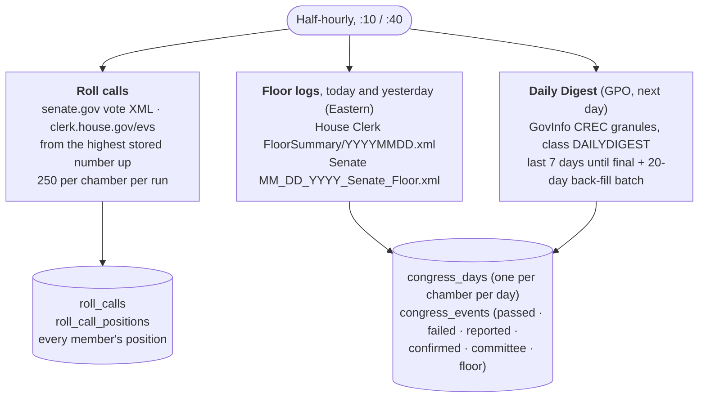

# Congress record

What each chamber did each day, for the `/congress` reports. Runs every half
hour at :10 and :40 UTC (`scheduler._congress_activity_sync`,
`backend/app/pipeline/congress_activity.py`).

**Newest first.** Each run reads the floor logs, then the recent Digests, then
the current session's roll calls, and only then the back-fill, so a fresh
database shows this week before the Congress's first months.

**The Digest's own words.** Every event keeps the record's wording. Parsing
only decides which heading an entry sits under ("Measures Passed:",
"Nominations Confirmed:", a House measure's own heading, "Suspensions:") and
pulls out the bill number. Entries split at page-reference lines and at
column-0 heading lines after a finished sentence; a two-space indent always
opens a sub-item, because continuation lines are at column 0
(`app/pipeline/fetch/daily_digest.py`, tested against real issues in
`backend/tests/fixtures/daily_digest`). Only a list heading keeps its
sub-items ("Measures Passed:", "Suspensions:", "Reports Filed:", "Nominations
Confirmed:", the Senate's "House Messages:"); the House indents a measure's
own paragraph after a page reference, so any other entry's indented
paragraphs are entries of their own, and the Senate's amendment sub-headings
("Adopted:", "Withdrawn:" …) continue the list above them. A passage is the
chamber's own sentence about it: a motion to table a resolution passes
nothing, a suspension that "failed" is a failure, a rule the House adopted
that day counts, and concurring in the other chamber's amendment is a passage.
Over 70 random session days this reads 244 of 246 passage sentences; the two
it leaves are a motion to discharge and a motion to table.

**The listing has pages.** A long Record issue has more granules than one
listing page (2025-02-20: 1,117), so the listing is followed to its end.
Read only to its first page, that day had no Digest and the back-fill stopped
there for months.

**A missing section is not a day off.** GovInfo's split of the Digest into
granules sometimes drops a chamber's section that the printed Digest has
(the House on 2025-02-07). A chamber with no section met if its own pages are
in the issue or it held a roll call that day; otherwise it did not meet. The
same split also drops the "Next Meeting" granule on some days (6 of 70
sampled, e.g. 2025-11-18): it is only in the PDF, so those days show no next
meeting.

**Re-reading.** `DIGEST_PARSE_VERSION` (`congress_activity.py`) names what
reading a Digest produces; raising it makes every run re-read a batch of the
days the back-fill had settled until all are read again.

**A file is not a session.** On a day the Senate does not meet, senate.gov
still publishes its floor file, holding only when it reconvenes; with no
opening and no proceedings it is a day not in session (on 2026-09-27 two
such files read as "The Senate met"). Every day of the last week still on
its floor log is read again each run, so a wrong row corrects itself.

**No Record.** A past day with no Congressional Record (behind the back-fill
cursor, or found absent three or more days on) is reported as that — no Record
published — not as "no record yet", and not as "neither chamber met" (GPO very
rarely combines two small days into one issue).

**Live, then final.** A chamber's floor log fills its day while it meets;
the Digest replaces the row (`is_final`) the next day. The floor log's timed
entries stay beside the Digest's, since only the House log has times.

**Absent is not failed.** A 404, or senate.gov's redirect of a missing file
to an HTML "not found" page, means the source has nothing for that day (the
chamber did not meet, the vote does not exist yet). Any other failure writes
nothing: a Digest day is never made final from part of its granules, and the
back-fill cursor stops before a failed day so the next run retries it. Each
run's per-source outcome is stored (`api_cache`, tier `congress`, key
`congress-sync-last-run`).

**Reports.** `app/services/congress_service.py` builds the day, week and
month reports from these rows: counts, "passed both chambers" (a measure
passed by the chamber it did not start in, or by its own chamber concurring
in the other's amendment; simple resolutions never count), confirmations
(each nominee the Digest counts; routine promotion lists, whose size it
doesn't give, are named rather than counted),
the three closest votes (by how far the yeas were from what the vote
needed: a simple majority, two-thirds of those voting, or cloture's 60), and
a one-line summary filled from counts by
template. Served at `/api/congress/{latest, day/…, week/…, month/…}`; one roll
call with every member's position at `/api/congress/votes/…`. A bill's full
record for its page, any bill of any Congress that has convened, at
`/api/bills/{id}/record?congress=N` (`app/services/bill_record.py`), within
a 10-second deadline: a part not fetched by then is `unavailable`, not
cached.

**Pages.** `/congress` (latest day), `/congress/{date}`, `/congress/week/{date}`,
`/congress/month/{YYYY-MM}` render these reports on the server
(`frontend/src/components/congress/`); `/congress/bills` is the in-motion list
and `/congress/bills/{id}?congress=N` any bill's page (without `?congress=`,
the current Congress's bill of that number), whose vote panel loads one roll
call's members at a time. `/bills` and `/bills/:id` redirect permanently.
`/congress` renders per request, since `next build` has no backend to
prerender it from. A failed fetch throws to `app/congress/error.tsx`, which
says the record could not be reached; only the backend's 404 is "nothing
recorded".

**Bluesky.** After each sync run, `analyze/congress_bluesky.py` posts the most
recent session day whose record the Digest has made final, if it is from the
last three days and not already posted: the day report's sentence and the
passed bills' numbers (never titles), linking to `/congress/{date}`. Once the
week (Monday to Sunday) is over and every day either chamber met is final, it
also posts that week: the week report's sentence and the numbers of the bills
that became law, linking to `/congress/week/{monday}`. Only the week just
ended is eligible.

**Bill ids** are the site's (`S.3257`, `HCONRES.89`) whichever spelling the
source used: the Record's "H. Con. Res. 89", the House roll call's
"H CON RES 89", the Senate log's "H.Con.Res. 89".
